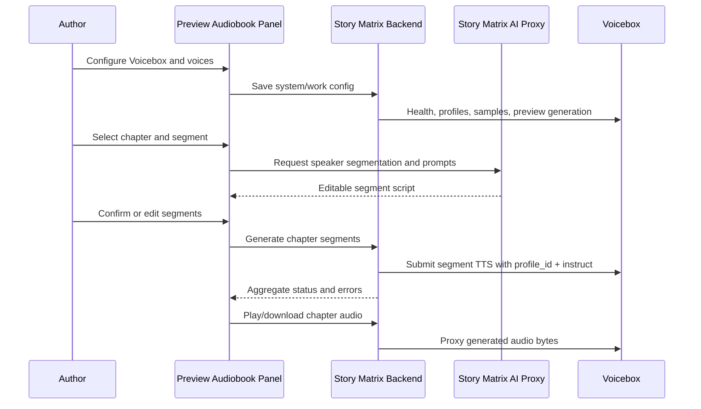
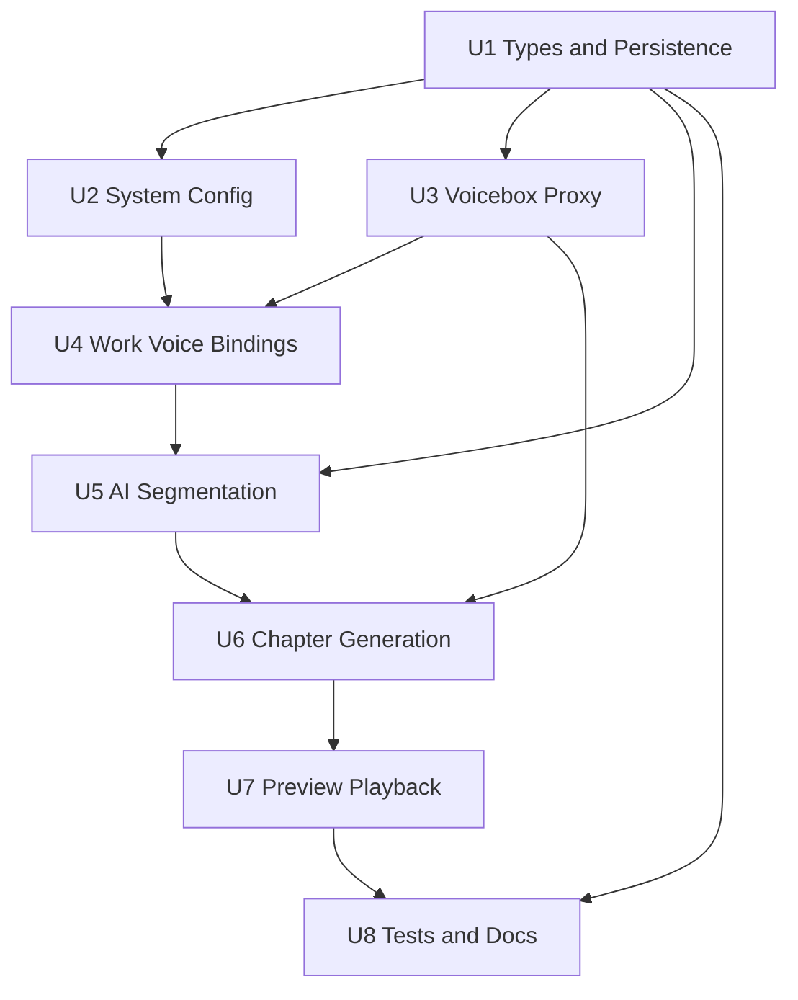

# feat: Add Voicebox Audiobook Generation

> Superseded note 2026-06-12: 该计划中的“全文预览入口”和“角色绑定卡片内上传参考音频”已被二期计划替换。当前实现以 `docs/plans/2026-06-12-001-feat-voicebox-user-sound-management-plan.md` 为准：声音上传在「声音管理」，章节音频生成在「章节丰盈」。

## Summary

Implement the first stable audiobook workflow under full-text preview: connect to a local Voicebox service, bind narrator and character voices, generate editable AI speaker segments, and produce chapter-level audio with retryable status. The plan follows the existing React/Zustand + Express/SQLite shape: Story Matrix AI owns story context and synthesis prompts, while Voicebox remains the source of voice profiles, reference samples, generated audio, and TTS execution.

---

## Problem Frame

Story Matrix AI already carries the novel from seed to finished chapter text, but the export surface is still text-only. The hard part is not a single TTS call; it is keeping a multi-character, long-form workflow recoverable when profile bindings, AI speaker detection, Voicebox availability, and segment generation can all fail independently.

---

## Requirements

- R1. Provide system-level Voicebox configuration with a default local service URL.
- R2. Validate Voicebox availability and endpoint contracts from the running local OpenAPI/schema rather than static summaries.
- R3. Read Voicebox voice profiles for selection, audition, and binding.
- R4. Place the audiobook feature under full-text preview as a post-draft export enhancement.
- R5. Persist narrator and character voice binding readiness; unbound active speakers must block generation.
- R6. Generate editable voice descriptions from character settings, tags, relationships, and work tone.
- R7. Generate editable Story Matrix AI-owned TTS prompts and pass them to Voicebox as synthesis instructions instead of relying on Voicebox personality prompts.
- R8. Support reference audio upload by creating or updating Voicebox profiles/samples while leaving voice assets managed by Voicebox.
- R9. AI-segment chapter text into narrator and character speech before generation.
- R10. Each segment must carry speaker, text, context or mood, and final Voicebox synthesis prompt.
- R11. Show the segment script before TTS and let users edit speaker, text, and prompt.
- R12. Allow re-running segmentation with an explicit overwrite choice for existing edits.
- R13. Generate audio per chapter so failures remain chapter-scoped.
- R14. Track stable task states: pending, generating, completed, failed, with retryable error details.
- R15. Allow chapter audio playback and download in the audiobook panel.
- R16. Optimize v1 for workflow stability, not publish-ready full audiobook production.

**Origin actors:** A1 作者, A2 Story Matrix AI, A3 Voicebox
**Origin flows:** F1 系统连接 Voicebox, F2 配置作品有声读物声音, F3 生成章节有声读物
**Origin acceptance examples:** AE1 connection/profile listing, AE2 unbound speaker blocking, AE3 reference upload to Voicebox, AE4 editable segment review before TTS, AE5 Story Matrix prompt ownership, AE6 partial failure retry/playback

---

## Scope Boundaries

- No whole-book audio stitching or one-click full-book export in v1.
- No three-level audio asset manager for segment, chapter, and book; chapter audio is the product unit.
- No Story Matrix AI voice library, model training, or copied voice asset store; uploaded samples are submitted to Voicebox profiles.
- No insertion into chapter writing or chapter generation flow; existing writing and preview behavior must stay intact.
- No publish-grade post-processing, multitrack mixing, sound effects, or detailed timeline editing.
- No reliance on Voicebox personality as the primary character-performance source.

### Deferred to Follow-Up Work

- Full-book export and chapter stitching: future iteration after chapter-level reliability is proven.
- Cross-work voice asset governance: future iteration if users need reusable character voice libraries outside Voicebox.
- Publish-grade audio mastering: future iteration after the core generation loop is stable.

---

## Context & Research

### Relevant Code and Patterns

- `src/pages/preview/PreviewPage.tsx` currently renders TOC, toolbar, full text, fullscreen reading, and text export controls; the audiobook panel belongs here rather than in `src/pages/chapters/ChaptersPage.tsx`.
- `src/features/preview/usePreview.ts` and `src/features/preview/exportUtils.ts` show the feature-hook plus pure utility pattern for preview-derived output.
- `src/core/types.ts` keeps `Work`, `Character`, and `Chapter` as the central data contract; audiobook state should be typed there or in a feature module and referenced from `Work`.
- `server/src/routes/works.ts` stores most work data as a `works.data` JSON blob and PATCH-merges an explicit nested-key allowlist; per-work audiobook state should extend this pattern.
- `server/src/routes/system-config.ts` and `src/core/system-config-store.ts` use a singleton system config; Voicebox URL/defaults should sit beside existing system settings.
- `server/src/routes/ai.ts` already proxies upstream AI APIs server-side, including streamed responses; Voicebox should follow the same same-origin backend proxy boundary.
- `src/ai/context.ts` and `src/ai/prompts/chapters.ts` provide reusable story/character context and strict JSON prompt patterns for segmentation and voice prompt generation.
- `src/ai/client.ts` demonstrates frontend streaming consumption and cleanup, but existing tests assert provider calls stay behind `/api/ai`.
- `test/model-config.test.mjs` and `test/user-management.test.mjs` are source-inspection behavior tests; add audiobook assertions in the same style unless the repo adopts a fuller test runner first.

### Institutional Learnings

- No `docs/solutions/` or strategy document exists in this repo, so planning is grounded in the requirements document, README, current code, and Voicebox schema research.

### External / Voicebox References

- Running local Voicebox OpenAPI confirmed `GET /health`, `GET/POST /profiles`, `GET /profiles/presets/{engine}`, `POST/GET /profiles/{profile_id}/samples`, `POST /generate`, `POST /generate/stream`, `GET /generate/{generation_id}/status`, `GET /audio/{generation_id}`, and `GET /samples/{sample_id}`.
- Running local schema confirmed `VoiceProfileCreate.voice_type` supports `cloned`, `preset`, and `designed`; sample upload requires multipart `file` plus `reference_text`; `GenerationRequest` requires `profile_id` and `text`, supports `engine`, `language`, `instruct`, chunking, crossfade, normalize, and effects.
- Voicebox frontend reference under `tmp/voicebox/app/src/lib/hooks/useGenerationProgress.ts` tracks active `EventSource` instances and closes them on completion/error; do not open unbounded SSE connections per segment.
- Voicebox sample upload reference under `tmp/voicebox/app/src/lib/api/client.ts` appends multipart `file` and `reference_text` without setting JSON content headers.
- Voicebox sample playback reference under `tmp/voicebox/app/src/components/VoiceProfiles/SampleList.tsx` plays raw samples through `/samples/{sample_id}`; profile audition requires generating short speech through `/generate` or `/generate/stream`.

---

## Key Technical Decisions

- Use explicit Express routes instead of a catch-all proxy: this keeps localhost Voicebox access behind auth, allows per-route validation, and avoids forwarding arbitrary user-controlled paths.
- Default Voicebox URL to `http://127.0.0.1:17493`, not `localhost`, to avoid Node IPv6 resolution mismatches when Voicebox binds IPv4 only.
- Store system Voicebox config in `systemConfig.voiceboxConfig`; store per-work voice bindings, segment scripts, and chapter generation metadata inside `Work.audiobook` in the existing work JSON blob.
- Persist edited segment scripts because they are user-reviewed creative decisions and must survive refresh; generated audio bytes remain in Voicebox, with Story Matrix AI persisting generation IDs and proxied audio references.
- Proxy generated audio and sample audio through Story Matrix AI rather than exposing Voicebox URLs to the browser, matching the current same-origin AI proxy pattern and avoiding CORS/direct-port coupling.
- Treat profile audition as a short Voicebox generation in v1; raw sample playback is only for reference sample inspection, not a full profile preview.
- Generate chapter segments sequentially or with a small controlled concurrency, and aggregate status in Story Matrix AI to avoid one SSE connection per segment.
- Pass Story Matrix AI-generated prompts through Voicebox `instruct`, while setting Voicebox personality usage off unless a later requirement explicitly changes that boundary.

---

## Open Questions

### Resolved During Planning

- Should chapter audio be proxied, cached locally, or linked directly from Voicebox? Resolve to backend proxy for v1; do not copy Voicebox audio into Story Matrix AI unless implementation proves direct proxy playback/download cannot satisfy browser behavior.
- Should segment scripts be persisted or transient? Persist them in `Work.audiobook` so user edits, retries, and overwrite decisions survive page refresh.
- How should existing profile audition work? Use a short `/generate` or `/generate/stream` preview phrase; no dedicated profile-preview endpoint exists in the verified Voicebox surface.
- How should long chapters map to generation jobs? Use segment-level generation records with chapter-level aggregate state, not a single monolithic chapter request.

### Deferred to Implementation

- Exact `GET /generate/{generation_id}/status` SSE event shape: verify against the running Voicebox instance and normalize only the status/error fields needed by this app.
- Whether `GET /audio/{generation_id}` supports HTTP Range requests: verify during proxy implementation and either forward Range or serve full audio if seeking remains acceptable.
- Whether `POST /generate` returns synchronously or queues immediately in the installed Voicebox version: implement the client around returned generation IDs and status probing, and adjust UX copy after runtime verification.
- Whether adding multipart support requires `multer`, native `FormData`, or a raw streaming proxy: choose the minimal server dependency during implementation after checking Node/Express support.

---

## Output Structure

    src/features/audiobook/
      useAudiobook.ts
      voiceboxClient.ts
      segmentUtils.ts
      audioUtils.ts
    src/ai/prompts/audiobook.ts
    src/pages/preview/AudiobookPanel.tsx
    src/pages/preview/VoiceBindingCard.tsx
    src/pages/preview/SegmentReviewTable.tsx
    src/pages/preview/ChapterAudioPlayer.tsx
    server/src/routes/voicebox.ts
    test/audiobook.test.mjs

The exact split may adjust during implementation, but the feature should remain isolated under `src/features/audiobook/` with preview-page components kept near the preview surface.

---

## High-Level Technical Design

> *This illustrates the intended approach and is directional guidance for review, not implementation specification. The implementing agent should treat it as context, not code to reproduce.*



---

## Implementation Units



### U1. Define Audiobook Data Model and Persistence

**Goal:** Add stable TypeScript and server persistence shapes for Voicebox config, voice bindings, segment scripts, and chapter audio state.

**Requirements:** R5, R8, R10, R12, R13, R14, R16; supports F2 and F3.

**Dependencies:** None.

**Files:**
- Modify: `src/core/types.ts`
- Modify: `src/core/store.ts`
- Modify: `server/src/routes/works.ts`
- Test: `test/audiobook.test.mjs`

**Approach:**
- Add `VoiceboxConfig`, `VoiceBinding`, `AudiobookSegment`, `ChapterAudioState`, and `WorkAudiobookConfig` types.
- Add optional `audiobook` state to `Work`, keyed by narrator, character ID, and chapter ID rather than display names.
- Extend work migration/defaulting in `src/core/store.ts` so older works load without missing-field crashes.
- Extend the `works` PATCH nested-key allowlist with `audiobook` so per-work audiobook state persists through the existing JSON blob path.
- Model binding readiness as source type plus active Voicebox profile/sample references, not as a loose boolean.

**Execution note:** Add characterization assertions before implementing route/store changes so the JSON persistence boundary stays explicit.

**Patterns to follow:**
- `src/core/types.ts` for domain interfaces.
- `src/core/store.ts` `migrateWork()` for backward-compatible defaults.
- `server/src/routes/works.ts` nested-key merge pattern for work JSON fields.

**Test scenarios:**
- Happy path: a work with `audiobook` in the PATCH payload is allowed through the work route nested-key merge.
- Edge case: a legacy work without `audiobook` loads with usable defaults instead of crashing preview/audiobook UI.
- Error path: audiobook state does not add `ownerId` or scalar mutation paths to `works` PATCH.
- Integration: updating chapter audio metadata preserves existing `seed`, `characters`, `outline`, and `chapters` in the JSON blob.

**Verification:**
- Audiobook state is typed, persisted, and backward-compatible with old works.
- Existing work CRUD behavior remains unchanged for non-audiobook fields.

### U2. Add System Voicebox Configuration

**Goal:** Add admin-managed system Voicebox settings and connection checks without exposing direct Voicebox access to the browser.

**Requirements:** R1, R2, R3; covers F1 and AE1.

**Dependencies:** U1 for shared config type references.

**Files:**
- Modify: `src/core/types.ts`
- Modify: `server/src/db.ts`
- Modify: `server/src/routes/system-config.ts`
- Modify: `src/core/system-config-store.ts`
- Modify: `src/pages/admin/AdminPage.tsx`
- Test: `test/audiobook.test.mjs`

**Approach:**
- Extend singleton config with `voiceboxConfig` containing service URL and default generation preferences that are safe to store.
- Use an additive database migration for the new system config field; do not rebuild tables.
- Preserve current public/admin config behavior: non-admin reads get safe config, admin writes are required for system settings.
- Add a Voicebox settings tab/card in system management with save, check connection, profile list refresh, and clear status display.
- Default to `http://127.0.0.1:17493`; allow user override for local trusted environments.

**Patterns to follow:**
- `src/pages/admin/AdminPage.tsx` `ModelSettings` form and connection-test pattern.
- `src/core/system-config-store.ts` singleton load/save pattern.
- `server/src/db.ts` additive migration helper style.

**Test scenarios:**
- Covers AE1. Happy path: admin saves Voicebox URL, checks connection, and sees available profiles returned through the backend.
- Edge case: default config exists for a fresh install even before the admin has saved Voicebox settings.
- Error path: Voicebox offline returns a recoverable connection error instead of a generic crash.
- Error path: non-admin PATCH of Voicebox config is rejected by the same admin boundary as other system settings.
- Integration: public system config reads do not expose sensitive AI config while still allowing safe Voicebox availability metadata.

**Verification:**
- System config can be saved, reloaded, and used by server-side Voicebox proxy routes.
- Existing AI model configuration still works and existing tests remain valid.

### U3. Implement Authenticated Voicebox Backend Proxy

**Goal:** Create explicit backend proxy routes for Voicebox health, profiles, preset voices, sample upload, generation, status, and audio serving.

**Requirements:** R2, R3, R8, R13, R14, R15; covers F1, F2, F3, AE1, AE3, AE6.

**Dependencies:** U2 for configured target URL.

**Files:**
- Create: `server/src/routes/voicebox.ts`
- Modify: `server/src/index.ts`
- Modify: `server/package.json`
- Modify: `server/package-lock.json`
- Modify: `src/core/api-client.ts`
- Create: `src/features/audiobook/voiceboxClient.ts`
- Test: `test/audiobook.test.mjs`

**Approach:**
- Mount `/api/voicebox` behind `requireAuth` so browser code never calls Voicebox directly.
- Add explicit route handlers for health, profiles, presets, profile creation, sample upload/list, preview generation, chapter generation, status relay, sample audio, and generated audio.
- Validate target IDs as path-safe strings before forwarding to Voicebox.
- For multipart sample upload, forward `file` and `reference_text` exactly as Voicebox expects; do not set JSON content headers for multipart requests.
- Stream audio responses rather than buffering full files in memory; forward content type and range-related headers when supported.
- Normalize Voicebox errors into user-readable JSON while preserving enough detail for troubleshooting.

**Technical design:** *(directional guidance, not implementation specification)*

```text
Browser -> /api/voicebox/* -> auth -> configured Voicebox URL -> normalized response

JSON routes: validate body -> fetch Voicebox -> JSON/error response
Multipart routes: parse/stream file + reference_text -> Voicebox FormData -> JSON/error
Audio routes: validate id -> fetch Voicebox audio/sample -> stream bytes to browser
Status route: validate id -> relay or normalize Voicebox status events -> close on terminal states
```

**Patterns to follow:**
- `server/src/routes/ai.ts` server-side upstream fetch and streamed response handling.
- `src/core/api-client.ts` token-aware same-origin API calls.
- `tmp/voicebox/app/src/lib/api/client.ts` multipart upload and audio URL reference behavior.

**Test scenarios:**
- Happy path: authenticated client can list Voicebox profiles through `/api/voicebox/profiles`.
- Covers AE3. Happy path: uploading a reference audio sample forwards multipart `file` and `reference_text` to Voicebox, not to a Story Matrix voice library.
- Error path: unauthenticated Voicebox proxy calls are blocked.
- Error path: unsafe profile or generation IDs are rejected before upstream forwarding.
- Error path: Voicebox offline returns a clear proxy error and does not mark bindings as ready.
- Integration: generated audio and sample audio URLs used by the frontend are same-origin `/api/voicebox/...` URLs, not direct `127.0.0.1:17493` URLs.

**Verification:**
- Voicebox can be checked, profiles listed, samples uploaded, preview speech generated, status read, and audio streamed through the backend proxy.
- No generic catch-all proxy exposes arbitrary local paths.

### U4. Build Work-Level Voice Binding UI

**Goal:** Let the author configure narrator and character voices in the preview audiobook panel by selecting existing profiles or uploading reference audio into Voicebox.

**Requirements:** R3, R4, R5, R6, R7, R8; covers F2, AE2, AE3, AE5.

**Dependencies:** U1, U2, U3.

**Files:**
- Create: `src/pages/preview/AudiobookPanel.tsx`
- Create: `src/pages/preview/VoiceBindingCard.tsx`
- Create: `src/features/audiobook/useAudiobook.ts`
- Create: `src/ai/prompts/audiobook.ts`
- Modify: `src/ai/context.ts`
- Modify: `src/pages/preview/PreviewPage.tsx`
- Test: `test/audiobook.test.mjs`

**Approach:**
- Add a preview-level Audiobook panel/tab without changing chapter writing flow or sidebar navigation.
- Render narrator plus all work characters as speakers with readiness state.
- Allow each speaker to choose an existing Voicebox profile, audition via a short generation, inspect existing samples, or upload a reference audio file plus transcript to a cloned profile.
- Generate editable voice descriptions and base TTS prompts from work tone, character bio, traits, tags, and relations.
- Persist only Voicebox IDs, cached display names, source metadata, editable descriptions, and prompts in the work; do not store uploaded audio bytes in Story Matrix AI.
- Treat a binding as ready only when its active source resolves to a usable Voicebox profile/sample configuration.

**Patterns to follow:**
- `src/pages/admin/AdminPage.tsx` Ant Design form/card/tab conventions.
- `src/features/world/useWorldBuilder.ts` patch-and-persist pattern for work substate.
- `src/ai/context.ts` story and character context formatting.

**Test scenarios:**
- Covers AE2. Error path: a chapter segment using an unbound speaker blocks generation and lists the missing speaker.
- Covers AE3. Happy path: uploading reference audio updates the active speaker binding with Voicebox profile/sample IDs and no local audio asset path.
- Covers AE5. Happy path: generated TTS prompt combines character base voice guidance with Story Matrix story context, not Voicebox personality.
- Edge case: narrator binding is required even though narrator is not a `Character` record.
- Edge case: switching a speaker from existing profile to uploaded reference marks the new active source and prevents silent use of the old source.
- Integration: refreshing Voicebox profiles flags stale bound profiles without deleting user-authored prompt text.

**Verification:**
- The author can complete voice setup for narrator and characters from the preview audiobook surface.
- Voice setup state survives refresh and reloads from the work JSON.

### U5. Add AI Chapter Segmentation and Editable Review

**Goal:** Generate and persist editable narrator/character segment scripts before any TTS generation starts.

**Requirements:** R9, R10, R11, R12; covers F3, AE4, AE5.

**Dependencies:** U1, U4.

**Files:**
- Create: `src/pages/preview/SegmentReviewTable.tsx`
- Modify: `src/features/audiobook/useAudiobook.ts`
- Create: `src/features/audiobook/segmentUtils.ts`
- Modify: `src/ai/prompts/audiobook.ts`
- Modify: `src/ai/context.ts`
- Test: `test/audiobook.test.mjs`

**Approach:**
- Add an AI prompt for strict JSON output containing ordered segments with speaker IDs/narrator, text, mood/context, and proposed synthesis prompt.
- Reuse story seed, character context, chapter outline summary, chapter content, and optional scene/emotion data.
- Normalize AI output into stable segment IDs and mark untouched generated fields separately from user-edited fields.
- Present segment rows before TTS with editable speaker, text, mood/context, and final prompt.
- Provide explicit re-segmentation behavior: warn that current segment edits can be overwritten, then replace the persisted segment script if confirmed.
- Validate that every segment speaker has a ready binding before generation can begin.

**Technical design:** *(directional guidance, not implementation specification)*

```text
Chapter content -> AI segmentation -> normalized segments -> user edits -> persisted script

Speaker sources:
- narrator
- characterId from work.characters
- unresolved speaker label requiring user correction
```

**Patterns to follow:**
- `src/pages/chapters/ChaptersPage.tsx` AI JSON parsing tolerance and persistence style.
- `src/ai/prompts/chapters.ts` structured prompt builder pattern.
- `src/features/preview/usePreview.ts` derived chapter list pattern.

**Test scenarios:**
- Covers AE4. Happy path: clicking chapter audio generation creates/reveals an editable segment table before any Voicebox TTS call.
- Covers AE5. Happy path: a tense character segment receives a prompt composed from base voice prompt plus current segment mood.
- Edge case: empty chapter content is blocked before segmentation.
- Edge case: AI returns an unknown speaker label; the row is marked unresolved and cannot generate until corrected.
- Edge case: re-running segmentation prompts overwrite confirmation when existing edited segments are present.
- Error path: malformed AI JSON surfaces a segmentation failure and preserves the previous valid segment script.

**Verification:**
- Users can inspect and correct speaker/text/prompt rows before generation.
- Segment scripts persist per chapter and can be safely regenerated or reused.

### U6. Generate Chapter Audio with Segment Status and Retry

**Goal:** Generate Voicebox audio per segment, aggregate chapter status, and support retry/cancel without regenerating completed work.

**Requirements:** R13, R14, R16; covers F3, AE2, AE6.

**Dependencies:** U3, U5.

**Files:**
- Modify: `server/src/routes/voicebox.ts`
- Modify: `src/features/audiobook/useAudiobook.ts`
- Create: `src/features/audiobook/audioUtils.ts`
- Modify: `src/pages/preview/AudiobookPanel.tsx`
- Test: `test/audiobook.test.mjs`

**Approach:**
- Run a preflight check before generation: Voicebox reachable, chapter has content, segment script exists, all speakers ready, and prompts/text are non-empty.
- Submit segment generations through the backend proxy with `profile_id`, segment text, language/engine defaults, and Story Matrix `instruct` prompt.
- Persist segment-level statuses, Voicebox generation IDs, errors, and timestamps as each segment changes state.
- Aggregate chapter state from segment states: pending, generating, completed, failed, partial failure.
- Retry only failed segments; keep completed segment generation IDs unchanged.
- Cancel only active/pending generation IDs where Voicebox supports cancel; mark local state consistently even if upstream cancellation fails.
- Avoid opening one browser SSE per segment; use controlled status polling or a single backend aggregation stream for active segment IDs.

**Patterns to follow:**
- `tmp/voicebox/app/src/lib/hooks/useGenerationProgress.ts` active EventSource cleanup and terminal-state handling.
- `tmp/voicebox/app/src/components/DictateWindow/DictateWindow.tsx` timeout backstop for missing terminal status.
- `src/pages/chapters/ChaptersPage.tsx` long-running AI operation state cleanup.

**Test scenarios:**
- Covers AE2. Error path: generation refuses to start when any segment speaker binding is missing.
- Covers AE6. Error path: if one segment fails after earlier segments complete, chapter state becomes partial failure and completed generation IDs remain available.
- Happy path: all segments complete and chapter status becomes completed with playable generation references.
- Edge case: page refresh during generation reloads persisted pending/generating segment states and can reconcile with Voicebox status.
- Error path: Voicebox status SSE disconnects or reports `failed`; only affected segments are marked failed with retry available.
- Integration: retry action submits only failed segments and does not duplicate completed audio.

**Verification:**
- Chapter generation is recoverable at segment level and never silently skips failed speakers or segments.
- Long-running generation does not leave stuck UI state when Voicebox disconnects.

### U7. Add Chapter Audio Playback and Download in Preview

**Goal:** Provide chapter-level playback and download controls for completed or partially completed chapter audio from the audiobook panel.

**Requirements:** R15, R16; covers F3 and AE6.

**Dependencies:** U6.

**Files:**
- Create: `src/pages/preview/ChapterAudioPlayer.tsx`
- Modify: `src/pages/preview/AudiobookPanel.tsx`
- Modify: `src/features/audiobook/audioUtils.ts`
- Modify: `server/src/routes/voicebox.ts`
- Test: `test/audiobook.test.mjs`

**Approach:**
- Play completed segment audio in chapter order through proxied `/api/voicebox/audio/...` URLs.
- Show partial-failure chapters with completed segments playable and failed segments clearly marked.
- Provide chapter-level download by fetching completed segment audio through the backend proxy and producing one chapter artifact. If byte-level audio concatenation proves unsafe without a dedicated audio processor, use a deterministic chapter package or manifest that still downloads as the chapter unit; do not reduce v1 to separate per-segment downloads only.
- Reuse `downloadBlob` style for browser-triggered downloads where the output is assembled client-side.
- Keep audio URLs same-origin and revocable; avoid persisting browser blob URLs in work state.

**Patterns to follow:**
- `src/features/preview/exportUtils.ts` `downloadBlob()` for browser download behavior.
- Voicebox audio URL usage in `tmp/voicebox/app/src/lib/api/client.ts`.
- Voicebox sample player behavior in `tmp/voicebox/app/src/components/VoiceProfiles/SampleList.tsx`.

**Test scenarios:**
- Covers AE6. Happy path: completed chapter audio can be played or downloaded after generation.
- Edge case: partial-failure chapter still allows playback/download of completed segments while exposing retry for failed ones.
- Error path: missing Voicebox audio returns a clear “audio lost, regenerate segment” state.
- Integration: audio playback and download go through Story Matrix backend proxy URLs, not direct Voicebox URLs.

**Verification:**
- Users can listen to generated chapter audio without leaving preview.
- Download behavior provides one chapter-level artifact and makes any internal segment structure transparent to the user.

### U8. Add Focused Tests, Manual QA Path, and Documentation Notes

**Goal:** Lock the intended architecture and user-visible workflow so implementation does not drift from requirements.

**Requirements:** R1-R16; covers AE1-AE6.

**Dependencies:** U1-U7.

**Files:**
- Create: `test/audiobook.test.mjs`
- Modify: `package.json`
- Modify: `README.md`
- Optionally modify: `docs/brainstorms/voicebox-audiobook-requirements.md`

**Approach:**
- Add source-inspection tests matching current repo style for route auth, proxy-only browser access, work PATCH allowlist, prompt ownership, and preview placement.
- Add README or docs notes explaining that Voicebox must run locally, default URL is configurable, and audio assets remain in Voicebox.
- Include a manual QA checklist covering local Voicebox down/up, profile list, upload sample, profile audition, segmentation review, unbound speaker block, partial generation failure, retry, playback, and download.
- Keep tests focused on architectural invariants until a component/server test runner exists.

**Patterns to follow:**
- `test/model-config.test.mjs` same-origin proxy assertions.
- `test/user-management.test.mjs` server route and permission boundary assertions.
- Existing README Chinese documentation style.

**Test scenarios:**
- Covers AE1. Test asserts Voicebox profile/model calls are routed through backend proxy.
- Covers AE2. Test asserts unbound speaker blocking exists before generation.
- Covers AE3. Test asserts reference upload uses Voicebox sample endpoint semantics and no Story Matrix voice-library path.
- Covers AE4. Test asserts segment review UI is present before generation controls.
- Covers AE5. Test asserts audiobook prompts are generated in Story Matrix prompt code and Voicebox personality is not primary.
- Covers AE6. Test asserts partial failure and retry states are represented.

**Verification:**
- New tests can run through `npm run test` or a documented added script.
- Manual QA checklist covers all critical happy paths and failure paths.

---

## System-Wide Impact

- **Interaction graph:** Preview UI, system admin settings, work JSON persistence, AI prompt generation, backend Voicebox proxy, and Voicebox runtime state now form one feature loop.
- **Error propagation:** Voicebox network errors, schema errors, generation failures, missing profiles, missing audio, and AI segmentation failures must surface as recoverable UI states, not generic toast-only failures.
- **State lifecycle risks:** Segment edits and generation IDs must persist; transient connection/profile status must refresh from Voicebox; blob/audio URLs must not be persisted.
- **API surface parity:** Browser code should call Story Matrix APIs only; direct Voicebox URLs are allowed only inside server-side proxy configuration and documentation examples.
- **Integration coverage:** The most important end-to-end scenario is: configure Voicebox -> bind voices -> segment a chapter -> edit segment -> generate -> fail one segment -> retry -> play/download.
- **Unchanged invariants:** Chapter writing, text preview, Markdown/TXT export, existing AI config, and user management must keep their current behavior.

---

## Risks & Dependencies

| Risk | Mitigation |
|------|------------|
| Multipart upload support is absent from the Express server | Add the smallest safe upload/proxy implementation and enforce file size/type limits before forwarding to Voicebox |
| Voicebox status SSE schema is runtime-specific | Verify against running `openapi.json` and observed events during implementation; normalize only terminal status/error fields |
| Too many segment status streams can exhaust browser/server connections | Use controlled polling or one aggregate status stream instead of one `EventSource` per segment |
| `GenerationRequest.instruct` has a 500 character schema limit | Keep final TTS prompts concise and store richer voice descriptions separately in Story Matrix work state |
| Work JSON blob can grow with many segment scripts | Persist v1 state in `Work.audiobook`, but monitor size and extract to a dedicated table only if implementation or tests show pressure |
| Voicebox URL/profile IDs can become stale when switching Voicebox instances | Refresh profiles and mark orphaned bindings as not ready while preserving user-authored descriptions/prompts |
| Chapter-level download may require real audio concatenation | Preserve chapter-level download as the user contract; choose safe concatenation, server-side packaging, or a manifest-based chapter artifact during implementation |
| Voicebox has no auth of its own | Keep Voicebox on local/trusted network and require Story Matrix auth for all proxy routes |

---

## Documentation / Operational Notes

- Document that users must run Voicebox locally or in a trusted environment before using audiobook generation.
- Document that uploaded reference audio goes to Voicebox profiles/samples and is not stored as a Story Matrix AI voice library.
- Document the default `http://127.0.0.1:17493` service URL and the need to re-check connection after changing it.
- Document that v1 generates chapter audio, not a complete publish-ready audiobook.

---

## Sources & References

- **Origin document:** `docs/brainstorms/voicebox-audiobook-requirements.md`
- Related code: `src/pages/preview/PreviewPage.tsx`
- Related code: `src/features/preview/usePreview.ts`
- Related code: `src/features/preview/exportUtils.ts`
- Related code: `src/core/types.ts`
- Related code: `src/core/store.ts`
- Related code: `src/core/api-client.ts`
- Related code: `src/core/system-config-store.ts`
- Related code: `server/src/routes/ai.ts`
- Related code: `server/src/routes/works.ts`
- Related code: `server/src/routes/system-config.ts`
- Related code: `server/src/db.ts`
- Voicebox local OpenAPI: `http://127.0.0.1:17493/openapi.json`
- Voicebox reference code: `tmp/voicebox/app/src/lib/api/client.ts`
- Voicebox reference code: `tmp/voicebox/app/src/lib/hooks/useGenerationProgress.ts`
- Voicebox reference code: `tmp/voicebox/app/src/components/VoiceProfiles/SampleList.tsx`
