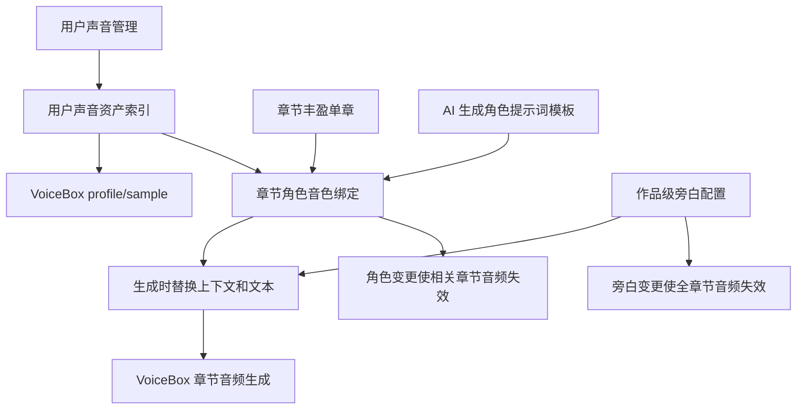
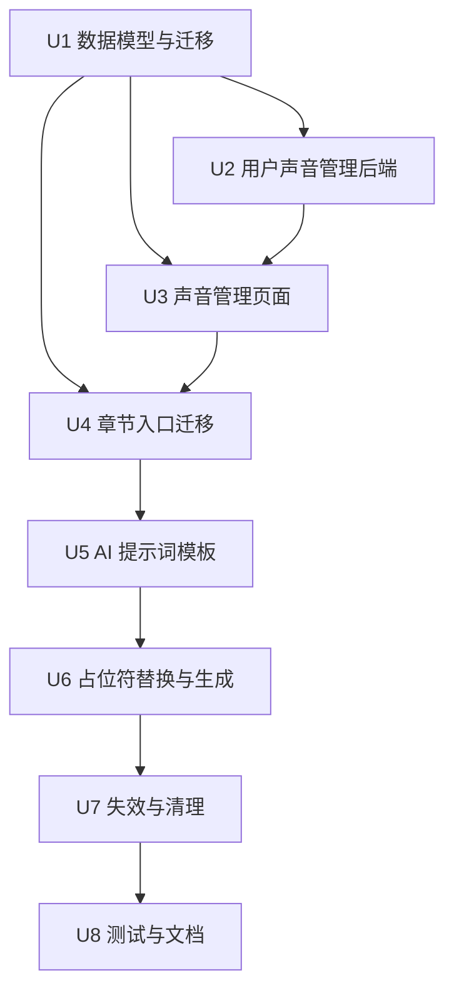

# feat: Optimize VoiceBox User Sound Management

## Summary

本计划在已完成的 VoiceBox 有声读物 v1 基础上做二期优化：把参考音频上传与音色命名集中到用户级「声音管理」，把有声读物工作流从全文预览迁移到「章节丰盈」的单章上下文，并将角色语音提示词改为可 AI 生成、可复用、生成时按上下文占位符替换的模板。

---

## Problem Frame

当前实现已经打通 VoiceBox 后端代理、作品级音色绑定、章节分段与音频生成，但用户操作路径和新需求不一致：音色上传散落在角色绑定卡片里，有声读物仍在全文预览页，角色提示词由分段阶段生成短 `instruct`，不支持用户要求的 QwenTTS 模板占位符。继续在旧结构上补按钮会让「音色资产管理」「章节生成」「提示词模板」三件事混在一起，后续很难解释为什么修改旁白会影响所有章节音频。

---

## Requirements

- R1. 每个登录用户必须有独立的「声音管理」配置页面，可管理自己创建的参考音频音色，包括上传、试听、删除和命名。
- R2. 参考音频上传必须统一发生在「声音管理」页面；章节角色绑定下拉中的「添加声音」只负责跳转，不再内嵌上传控件。
- R3. 声音管理中的用户自建音色仍由 VoiceBox profile/sample 承载，Story Matrix AI 只保存用户归属、展示名、VoiceBox ID、参考文本和必要元数据。
- R3a. 上传参考音频前必须让用户确认“这是自己的声音或已获得授权”，并把确认时间随声音资产保存。
- R4. 「有声读物」入口必须从「全文预览」迁移到「章节丰盈」的每个章节内，只在该章节 `AI 生成正文` 成功或已有正文后展示。
- R5. 旁白音色与旁白提示词必须作为作品级全局设置，各章节共用；修改旁白音色或旁白提示词时必须移除所有章节已生成音频状态。
- R6. 每个章节绑定角色音色时，只能选择用户可用音色并设定该角色在该章节使用的基本提示词；角色提示词默认空。
- R7. 角色提示词旁必须提供「AI 生成提示词」按钮，调用现有 AI 模型基于世界观与角色设定生成 100-200 字 QwenTTS 提示词模板，并填入角色提示词。
- R8. AI 生成角色提示词必须使用用户提供的固定提示词结构，保留 `【上下文】` 和 `【文本】` 占位符，不输出额外解释。
- R9. 生成章节音频时，角色台词必须直接读取该角色当前保存的角色提示词，并将 `【上下文】` 替换为说话内容前三个段落到说话开始之间的文本，将 `【文本】` 替换为本次朗读内容。
- R10. 旁白生成也必须使用作品级旁白提示词和同一占位符替换规则，但旁白配置只设置一次并被所有章节复用。
- R11. 修改角色音色、角色提示词、旁白音色或旁白提示词后，受影响的章节音频必须明确失效，不能继续展示为可用成品。
- R12. 现有 VoiceBox 安全边界必须保留：浏览器只访问 Story Matrix AI 后端代理，不能直连 VoiceBox 或持有 VoiceBox 上游鉴权。

**Origin actors:** A1 作者, A2 Story Matrix AI, A3 VoiceBox
**Origin flows:** F1 系统连接 VoiceBox, F2 配置作品有声读物声音, F3 生成章节有声读物
**Origin acceptance examples:** AE1 connection/profile listing, AE2 unbound speaker blocking, AE3 reference upload to VoiceBox, AE4 editable segment review before TTS, AE5 Story Matrix prompt ownership, AE6 partial failure retry/playback

---

## Scope Boundaries

- 不重新实现 VoiceBox 系统配置、后端代理、鉴权注入、音频代理播放的 v1 基础能力；本计划只调整其上层产品结构与数据归属。
- 不把 Story Matrix AI 变成独立音色库或训练系统；用户声音资产仍以 VoiceBox profile/sample 为实际来源。
- 不做整本有声书拼接、发布级后期、多轨混音或音效设计。
- 不在本计划内设计跨用户共享音色市场；「声音管理」只管理用户自己创建的声音，章节音色下拉可额外选择 VoiceBox 公共/预设 profile（若当前代理允许）。
- 不自动推断所有章节角色提示词；用户在章节内按需生成或编辑角色提示词。
- 不在计划阶段决定精确 UI 视觉稿；实现应沿用 Ant Design 现有页面风格。

### Deferred to Follow-Up Work

- 批量为整部作品角色生成提示词：可在单章流程稳定后再做。
- 声音资产配额、审计报表与授权证明文件管理：本计划只做上传时授权确认，不做完整合规工作流。
- 章节音频真正合并为单文件：当前继续允许清单/片段级播放下载，除非实现阶段已有可靠音频拼接能力。

---

## Context & Research

### Relevant Code and Patterns

- `src/core/types.ts` 已有 `VoiceboxConfig`、`VoiceBinding`、`AudiobookSegment`、`WorkAudiobookConfig`，但缺少用户级声音资产、章节级绑定和提示词模板版本信息。
- `src/features/audiobook/useAudiobook.ts` 当前同时负责 profile 刷新、绑定、上传、AI 分段和生成；二期需要拆出声音管理与章节生成职责，避免页面组件直接拥有上传逻辑。
- `src/pages/preview/AudiobookPanel.tsx` 是上一版有声读物入口；新需求要求从这里迁出，保留全文预览的文本预览职责。
- `src/pages/preview/VoiceBindingCard.tsx` 当前包含选择、提示词保存和上传控件；新需求要求移除上传控件，改为下拉「添加声音」跳转。
- `src/pages/chapters/ChaptersPage.tsx` 已有章节正文生成成功、当前章节、涉及角色、正文编辑器和事件簿上下文，是承载章节级有声读物面板的目标页面。
- `src/ai/prompts/audiobook.ts` 当前只生成短分段 `prompt`；需要新增 QwenTTS 角色提示词模板生成 prompt，并把分段 prompt 改为运行时模板填充结果。
- `src/features/audiobook/segmentUtils.ts` 当前在标准化分段时写入短 prompt；二期应改为保存 speaker/text/mood，最终 `instruct` 在生成前由绑定提示词模板和上下文替换得到。
- `server/src/routes/voicebox.ts` 已有 authenticated proxy、profile owner 过滤、sample 上传、生成和音频代理；声音管理页面应复用这些路由并补足删除能力。
- `server/src/routes/voicebox.ts` 当前 sample/audio 代理只校验 ID 字符，不校验 sample 或 generation 是否属于当前用户作品；二期必须补上本地索引/作品记录授权。
- `test/audiobook.test.mjs` 采用源码断言锁定架构边界；二期应继续用该文件覆盖入口迁移、上传集中化、提示词模板和失效规则。
- `README.md` 已描述旧的「全文预览」有声读物流程；二期完成后需要同步更新为「声音管理 + 章节丰盈」流程。

### Institutional Learnings

- `docs/brainstorms/voicebox-audiobook-requirements.md` 明确 VoiceBox 是音色和 TTS 执行来源，Story Matrix AI 负责故事上下文与提示词；本计划保留该边界。
- `docs/plans/2026-06-11-001-feat-voicebox-audiobook-generation-plan.md` 已解决 VoiceBox 代理、profile 上传、章节级生成、错误恢复和音频代理等基础问题；本计划是扩展与重排，不是推翻重写。
- 旧计划的「入口放在全文预览」已被新需求明确替换为「章节丰盈每章内」，需要在计划中显式列为 superseded decision，避免实现者继续维护双入口。

### External References

- Qwen3-TTS 官方文档说明 Base voice cloning 推荐提供清晰参考音频和对应 `ref_text`，ICL 模式下 `ref_text` 影响克隆质量；声音管理上传必须继续要求参考音频文本。
- Qwen3-TTS 官方文档说明 1.7B CustomVoice 支持 `instruct` 控制情绪、语速和风格，0.6B CustomVoice 忽略 instruction；计划应保留 `instruct` 长度与模型能力风险。
- Qwen3-TTS 官方 README 建议把参考音频生成 reusable voice prompt 后复用到多段文本；Story Matrix AI 不直接做该缓存，但应通过 VoiceBox profile/sample 复用同一音色。
- `jamiepine/voicebox` 参考实现中 sample 上传接口需要 multipart `file` 和 `reference_text`，后端多引擎通过 `create_voice_prompt(audio_path, reference_text)` 或等价路径缓存/处理参考音频。

---

## Key Technical Decisions

- 以「用户声音资产」作为新的一等概念，而不是继续把上传绑在作品角色上：同一个用户可能在不同作品复用自己的声音，集中管理也能让删除、试听、命名和权限更清晰。
- 保留 VoiceBox profile/sample 为真实资产源，只在 Story Matrix AI 记录本地索引：这样符合 v1 边界，也避免把音频文件和模型 prompt cache 复制到本系统。
- 将有声读物 UI 迁移到章节丰盈，不保留全文预览双入口：新需求把音频生成定义为 `AI 生成正文` 后的章节后续步骤，双入口会造成状态解释和测试成本翻倍。
- 旁白配置仍放在作品级全局，但入口显示在章节面板中：旁白跨章节一致是用户明确要求；章节面板只提供查看/编辑入口并触发全局失效。
- 角色提示词存为模板而非每段生成结果：模板保留 `【上下文】`、`【文本】`，生成时按当前文本位置替换，才能让同一角色在不同台词中复用稳定表达规则。
- 章节绑定记录应包含提示词版本或绑定更新时间：生成音频可用性必须能判断是否落后于当前旁白/角色配置，不能只看 `generationId` 是否存在。
- 修改旁白后清空所有章节音频；修改角色后只清空包含该角色或使用该角色绑定的章节音频：旁白影响全书叙述一致性，角色影响范围可按分段 speaker 计算。
- 继续把 VoiceBox `instruct` 控制在后端/客户端既有限制内：用户模板要求 100-200 字，但最终替换上下文后可能超过 VoiceBox 当前 500 字限制，需要生成前做明确裁剪或提示。

---

## Open Questions

### Resolved During Planning

- 是否继续允许角色绑定卡片直接上传参考音频？否。上传统一进入「声音管理」，章节绑定只选择音色或跳转添加。
- 是否保留全文预览中的有声读物面板？否。新需求明确把入口放到章节丰盈每章内，旧入口应移除或替换为指向章节页的说明。
- 角色提示词默认应如何初始化？默认空，只有用户手动输入或点击「AI 生成提示词」后才保存模板。
- AI 生成角色提示词是否仍用短 `mood` prompt？否。二期新增独立 QwenTTS 模板生成 prompt，章节生成时用模板占位符替换得到最终 `instruct`。
- 声音管理删除是否删除 VoiceBox 远端 profile/sample？计划内需要提供删除入口，但实现应优先以当前 VoiceBox API 支持情况决定：能删远端则同步删除，不能删则删除本地索引并标记不可用。

### Deferred to Implementation

- VoiceBox 当前实例是否提供 `DELETE /profiles/{id}` 或 `DELETE /samples/{id}`：实现阶段以运行 OpenAPI 为准，决定删除是远端删除还是本地解绑。
- 最终 `instruct` 超过 VoiceBox 字段限制时的裁剪策略：实现阶段应用最小可解释策略，优先保留角色规则和当前 `【文本】`，再裁剪较早上下文。
- “前三个段落到说话开始”在 Markdown、空行和引号嵌套中的精确解析：实现阶段用现有章节 Markdown 文本编写纯函数并以测试锁定。
- 用户可用音色是否包含 VoiceBox 公共 profile 与自己创建 profile 的合并展示：保留现有代理过滤原则，具体文案和分组在实现时按接口返回确定。
- 用户声音索引的最终存储形态：优先新增 server-side SQLite 表以表达 owner、displayName、profileId、sampleId、referenceText、consentConfirmedAt、deletedAt；若实现证明复用现有 system config 更简单，也必须提供等价字段和 owner-scoped 查询能力。

---

## High-Level Technical Design

> *This illustrates the intended approach and is directional guidance for review, not implementation specification. The implementing agent should treat it as context, not code to reproduce.*



---

## Implementation Units



### U1. 扩展用户声音与章节绑定数据模型

**Goal:** 为用户级声音资产、章节级角色绑定、旁白全局配置和提示词版本建立稳定类型与持久化结构。

**Requirements:** R1, R3, R5, R6, R9, R10, R11; supports F2 and F3.

**Dependencies:** None.

**Files:**
- Modify: `src/core/types.ts`
- Modify: `src/core/store.ts`
- Modify: `server/src/db.ts`
- Modify: `server/src/routes/works.ts`
- Test: `test/audiobook.test.mjs`

**Approach:**
- 新增用户声音资产类型和后端持久化结构，例如本地 `soundId`、`ownerId`、展示名、VoiceBox `profileId`、`sampleId`、参考文本、授权确认时间、删除状态、试听状态、创建/更新时间。
- 将 `VoiceBinding` 从“作品级旁白/角色绑定”升级为可引用用户声音资产的绑定，保留 VoiceBox profile 兼容字段以迁移旧数据。
- 在 `WorkAudiobookConfig` 中区分作品级旁白配置、章节级角色绑定、分段脚本和章节音频状态。
- 为旁白与角色提示词记录 `promptUpdatedAt` 或等价版本字段，供音频失效判断使用；为分段记录 `sourceStartOffset`、`sourceParagraphIndex` 或等价定位字段，保证重复台词也能计算“说话开始”上下文。
- 对旧 works 中已有 `audiobook.narratorBinding`、`characterBindings`、`segmentsByChapter` 做兼容迁移，不删除用户已有生成记录，只标记为旧结构待刷新。

**Execution note:** 先补源码断言或迁移测试，锁定旧作品仍可加载，再改类型与迁移逻辑。

**Patterns to follow:**
- `src/core/store.ts` `migrateWork()` 的旧数据补默认值模式。
- `server/src/routes/works.ts` nested-key allowlist 持久化模式。
- `test/audiobook.test.mjs` 源码级行为断言风格。

**Test scenarios:**
- Happy path: 新作品初始化后包含空的用户声音引用能力、全局旁白配置和空章节绑定。
- Edge case: 旧作品只有 v1 `characterBindings` 时仍能加载，并能在章节面板中识别旧绑定。
- Edge case: 角色提示词默认值为空，而不是自动继承旧 `buildVoicePrompt()` 结果。
- Edge case: 两段文本相同的台词能通过 offset 或 paragraph index 区分上下文位置。
- Integration: 保存某章节角色绑定不覆盖其他章节绑定、章节正文、角色列表或旁白配置。
- Error path: `works` PATCH 允许 `audiobook` 子树，但不新增绕过 owner 权限的字段。

**Verification:**
- 数据模型能表达用户声音资产、全局旁白、章节角色绑定、提示词版本和章节音频状态。
- 旧作品升级后不因缺字段导致章节页或预览页崩溃。

### U2. 补齐用户声音管理后端能力

**Goal:** 在现有 VoiceBox 后端代理上增加用户级声音资产的创建、列表、重命名、试听、授权确认和删除语义。

**Requirements:** R1, R2, R3, R12; covers F1 and AE3.

**Dependencies:** U1.

**Files:**
- Modify: `server/src/routes/voicebox.ts`
- Modify: `server/src/db.ts`
- Modify: `server/src/index.ts`
- Create: `server/src/routes/user-voices.ts`
- Modify: `src/features/audiobook/voiceboxClient.ts`
- Test: `test/audiobook.test.mjs`

**Approach:**
- 复用 `/api/voicebox/profiles`、`/profiles`、`/profiles/:profileId/samples` 和音频代理路由，新增本地用户声音索引的 CRUD 边界；索引需要能保存展示名、sampleId、参考文本、授权确认、软删除状态和 owner。
- 创建声音时先创建用户拥有的 VoiceBox cloned profile，再上传 sample；保存本地 sound 索引和 owner 关系。
- 上传前校验文件大小、扩展名/MIME 和基础音频字段；避免继续使用无上限内存 buffer 接收任意 multipart。
- 重命名优先更新本地显示名；若 VoiceBox 支持 profile 更新，再同步远端名称。
- 试听优先播放用户拥有的 sample 原音；若 sample 不可播且需要试听合成效果，才使用短文本走 `/generate`，但不得把试听生成误认为章节音频。
- 删除时检查 owner；VoiceBox 支持远端删除则同步删除，不支持则软删除本地索引并让下游绑定标记为不可用。
- sample 播放、试听生成、生成状态和音频代理都必须校验当前用户是否拥有该 sound，或该 generationId 是否记录在当前用户可访问的作品章节里。
- 新增代理端点仍只能拼接固定 VoiceBox 路由和安全 ID，不能接收任意 upstream path 或 URL。
- 所有浏览器请求继续走 same-origin `/api/voicebox` 或新增受保护 API，不暴露 VoiceBox service URL 与鉴权字段。

**Patterns to follow:**
- `server/src/routes/voicebox.ts` `currentUser.id` owner 过滤与 `canUploadSample()` 权限判断。
- `src/features/audiobook/voiceboxClient.ts` same-origin proxy client。
- `server/src/routes/system-config.ts` 配置凭据 mask/merge 思路。

**Test scenarios:**
- Happy path: 登录用户上传参考音频和参考文本后，获得仅自己可见的声音资产记录。
- Happy path: 上传前用户勾选授权确认，声音资产保存 `consentConfirmedAt` 或等价字段。
- Happy path: 用户可以重命名自己的声音，章节下拉显示新名称。
- Happy path: 用户可以试听自己上传的 sample 或短文本合成预览。
- Error path: 用户不能删除、重命名或给其他用户拥有的声音追加 sample。
- Error path: 过大文件、非音频文件或缺少参考文本会在转发 VoiceBox 前被拒绝。
- Error path: VoiceBox 离线时声音创建失败，不能留下 ready 状态的本地索引。
- Integration: 「声音管理」列表只展示用户自建声音；章节下拉可合并显示用户自建声音与可用公共/预设 profile，并用分组区分来源。
- Integration: 非 owner 不能通过 sample/audio/generation 代理读取他人的声音或章节音频。

**Verification:**
- 声音管理后端能支持页面所需操作，并保持现有 VoiceBox 代理安全边界。
- 删除或远端不可用状态能被章节绑定识别为不可用。

### U3. 新增用户级「声音管理」页面

**Goal:** 提供每个用户管理自己参考音频音色的独立页面，承接上传、试听、删除和命名。

**Requirements:** R1, R2, R3.

**Dependencies:** U1, U2.

**Files:**
- Modify: `src/App.tsx`
- Modify: `src/components/layout/Sidebar.tsx`
- Create: `src/pages/voices/VoicesPage.tsx`
- Create: `src/features/audiobook/useUserVoices.ts`
- Modify: `src/features/audiobook/voiceboxClient.ts`
- Test: `test/audiobook.test.mjs`

**Approach:**
- 增加受保护路由 `/voices`，侧边栏中文名称为「声音管理」。
- 页面展示用户创建的声音列表：名称、VoiceBox profile/sample 状态、参考文本摘要、试听按钮、重命名和删除入口。
- 上传表单要求音色名称、音频文件、参考文本和授权确认；参考文本不能为空，因为 Qwen3-TTS voice cloning 推荐/依赖 `ref_text`。
- 页面必须覆盖空列表、上传中、试听中、VoiceBox 离线、sample 不可用、删除失败、删除后仍被章节引用这些状态。
- 删除使用明确确认弹窗，文案说明可能影响章节绑定；真正失效由 U7 统一处理。
- 页面只处理声音资产，不显示章节、角色或作品绑定，避免职责混淆。

**Patterns to follow:**
- `src/pages/admin/AdminPage.tsx` Ant Design Card/Form/List 操作布局。
- `src/components/layout/Sidebar.tsx` 路由导航项模式。
- `src/pages/works/WorksPage.tsx` 用户可见资源列表与确认删除交互。

**Test scenarios:**
- Happy path: 用户从侧边栏进入「声音管理」，上传音频后列表出现新音色。
- Happy path: 点击试听时使用 same-origin 代理 URL，不直接访问 VoiceBox。
- Edge case: 未填写参考文本时阻止上传并解释原因。
- Edge case: 未勾选授权确认时阻止上传并解释声音使用边界。
- Error path: VoiceBox 离线时保留表单输入，允许用户稍后重试。
- Error path: 删除声音前出现确认，取消不会改变列表。
- Integration: 上传成功后的声音能被章节绑定下拉读取。

**Verification:**
- 用户能在一个页面完成参考音频声音的上传、试听、重命名和删除。
- 章节绑定 UI 不再承担上传职责。

### U4. 将有声读物入口迁移到章节丰盈

**Goal:** 把有声读物控制从全文预览迁移到每个已生成正文的章节中，并按章节涉及角色绑定音色。

**Requirements:** R2, R4, R5, R6; covers F2 and F3.

**Dependencies:** U1, U3.

**Files:**
- Modify: `src/pages/chapters/ChaptersPage.tsx`
- Create: `src/pages/chapters/ChapterAudiobookPanel.tsx`
- Modify: `src/pages/preview/PreviewPage.tsx`
- Modify: `src/pages/preview/AudiobookPanel.tsx`
- Modify: `src/pages/preview/VoiceBindingCard.tsx`
- Modify: `src/features/audiobook/useAudiobook.ts`
- Test: `test/audiobook.test.mjs`

**Approach:**
- 在 `ChaptersPage` 当前章节正文编辑器下方或侧旁增加「有声读物」折叠面板，只在 `activeChapter.content.trim()` 存在时显示；默认收起，生成中不阻断正文编辑但禁用会造成状态冲突的音频操作。
- 无正文时在章节页显示轻量提示“AI 生成正文后可配置有声读物”，不显示生成按钮。
- 面板顶部显示作品级旁白音色与旁白提示词配置入口，说明改动会影响所有章节音频。
- 根据当前大纲节点涉及角色与已分段 speaker 计算本章角色列表；每个角色行只包含音色选择、提示词编辑、保存提示词、AI 生成提示词。
- 音色下拉包含用户可用声音、可用公共/预设 profile 和「添加声音」选项；选择「添加声音」跳转 `/voices` 时携带当前章节和角色上下文，上传成功后返回原章节并预选新声音，取消上传则返回原章节且不改变绑定。
- 从全文预览移除旧 `AudiobookPanel` 主流程；若保留提示，只展示“请到章节丰盈生成章节音频”的导航说明。

**Patterns to follow:**
- `src/pages/chapters/ChaptersPage.tsx` 当前章节上下文和 `getOutlineNode()` 涉及人物展示。
- `src/pages/preview/AudiobookPanel.tsx` 现有分段、生成、播放器交互可迁移复用。
- `src/features/audiobook/useAudiobook.ts` 持久化 work audiobook 子状态的方式。

**Test scenarios:**
- Happy path: AI 生成正文成功后，当前章节显示有声读物面板。
- Happy path: 用户在章节面板中为涉及角色选择已有声音并保存空/自定义提示词。
- Happy path: 用户通过「添加声音」上传成功后回到原章节，新增声音自动成为该角色当前选项。
- Edge case: 没有正文的章节不显示生成音频入口，只提示先生成正文。
- Edge case: 下拉选择「添加声音」跳转声音管理，不弹出上传控件。
- Edge case: 章节切换后，折叠面板的章节绑定状态来自当前章节，不沿用上一章节的临时选择。
- Error path: 旧全文预览页不再出现完整有声读物生成流程。
- Integration: 本单元同步更新旧的 `test/audiobook.test.mjs` 入口断言，避免迁移期间测试继续锁定全文预览主流程。
- Integration: 切换章节时，每章显示自己的角色绑定和音频状态，旁白配置保持一致。

**Verification:**
- 有声读物操作位于章节丰盈单章上下文内。
- 章节角色绑定不再允许直接上传参考音频。

### U5. 新增 AI 生成 QwenTTS 角色提示词模板

**Goal:** 为章节角色绑定提供「AI 生成提示词」能力，生成符合用户固定格式的 QwenTTS 模板。

**Requirements:** R6, R7, R8, R10; covers AE5.

**Dependencies:** U4.

**Files:**
- Modify: `src/ai/prompts/audiobook.ts`
- Modify: `src/features/audiobook/useAudiobook.ts`
- Modify: `src/pages/chapters/ChapterAudiobookPanel.tsx`
- Modify: `src/ai/context.ts`
- Test: `test/audiobook.test.mjs`

**Approach:**
- 在 `src/ai/prompts/audiobook.ts` 新增角色提示词模板生成函数，使用用户提供的完整任务提示词作为核心结构。
- `# 世界观` 使用当前作品世界观/设定上下文，`# 角色设定` 使用该角色 bio、traits、habits、relations、tags 和相关设定。
- 系统提示要求只输出模板正文，长度 100-200 字，必须包含 `【上下文】` 和 `【文本】`。
- 旁白提示词不提供角色式 AI 自动生成；初始化可为空或迁移旧值，用户手动编辑后作为作品级模板保存。
- 点击「AI 生成提示词」只填入文本框，不自动保存；若文本框已有未保存内容，先确认是否覆盖；用户点击「保存提示词」后才更新绑定版本并触发后续失效规则。
- 按钮需要展示 loading，生成失败时保留原文本；AI 返回缺占位符时以字段错误呈现，不覆盖文本框。

**Technical design:** *(directional guidance, not implementation specification)*

```text
世界观 + 角色设定 -> AI 模板生成 -> 文本框预填 -> 用户确认保存 -> 绑定 promptTemplate

模板必须保留：
- 角色/音色/基调/节奏摘要
- 规则列表
- 当前语境：【上下文】
- 朗读：【文本】
```

**Patterns to follow:**
- `src/ai/prompts/chapters.ts` 严格输出格式的 prompt builder。
- `src/pages/world/CharactersPanel.tsx` 点击 AI 生成后填充可编辑字段的交互。
- `src/ai/context.ts` 作品上下文拼接函数。

**Test scenarios:**
- Happy path: 点击角色的「AI 生成提示词」后，文本框填入包含两个占位符的模板。
- Happy path: 用户编辑后点击保存，章节绑定保存该模板而不是短 prompt。
- Edge case: AI 返回缺少 `【上下文】` 或 `【文本】` 时提示失败，不覆盖用户现有输入。
- Edge case: 角色提示词初始为空，未点击 AI 生成时不会自动填入旧默认 prompt。
- Edge case: 已有未保存提示词时再次点击 AI 生成，需要确认覆盖。
- Error path: 未配置 AI 时按钮提示先配置 AI，不改变当前提示词。
- Integration: 生成提示词使用世界观与角色设定，不依赖 VoiceBox personality prompt。

**Verification:**
- 角色提示词模板生成符合用户指定格式和占位符要求。
- 保存与生成动作分离，用户可审查后再影响音频状态。

### U6. 按模板占位符生成章节音频 instruct

**Goal:** 在生成每段音频时用角色/旁白模板替换 `【上下文】` 与 `【文本】`，再传给 VoiceBox。

**Requirements:** R5, R9, R10, R12; covers F3 and AE5.

**Dependencies:** U5.

**Files:**
- Modify: `src/features/audiobook/segmentUtils.ts`
- Modify: `src/features/audiobook/useAudiobook.ts`
- Create: `src/features/audiobook/promptTemplateUtils.ts`
- Modify: `src/ai/prompts/audiobook.ts`
- Test: `test/audiobook.test.mjs`

**Approach:**
- 从分段标准化中移除“每段 AI 生成最终 prompt”的主职责，分段只保存 speaker、text、mood/order 等生成所需事实。
- 新增纯函数根据完整章节正文、当前 segment 的 `sourceStartOffset`/`sourceParagraphIndex` 和段落边界提取上下文：范围为“说话内容前三个段落”到“说话开始”。
- AI 分段或标准化阶段必须为每个 segment 记录可重算的来源位置；如果无法可靠定位，生成前标记该 segment 需要用户重新分段。
- 生成前读取 speaker 对应模板：旁白使用全局旁白模板，角色使用本章角色绑定模板；模板为空时阻止生成并提示补全。
- 用当前上下文替换 `【上下文】`，用当前段落文本替换 `【文本】`，得到最终 `instruct`。
- 最终 `instruct` 进入 VoiceBox `/generate`；若超过 VoiceBox 限制，采用可测试的裁剪策略并在 UI 中提示“已按 VoiceBox 限制裁剪”。
- 保留 `segment.text` 作为 VoiceBox `text` 字段，不把整段模板当作朗读文本。

**Patterns to follow:**
- `src/features/audiobook/segmentUtils.ts` 纯函数化解析和标准化。
- `src/features/audiobook/useAudiobook.ts` 当前逐 segment 调用 `voiceboxClient.generate()` 的顺序生成逻辑。
- `test/audiobook.test.mjs` 对 prompt ownership 和 engine/instruct 边界的断言。

**Test scenarios:**
- Happy path: 角色 segment 使用该角色保存模板，替换出的 instruct 包含前三段上下文和当前朗读文本。
- Happy path: 旁白 segment 使用全局旁白模板，而不是章节角色模板。
- Edge case: 章节开头第一段说话时，上下文为空或仅包含可用前文，不抛错。
- Edge case: 连续多段同一角色说话时，每段上下文只取到该段开始前，不包含当前 `【文本】` 后的内容。
- Edge case: 章节中出现重复台词时，使用 segment 来源位置而不是 `text.indexOf()` 找到说话开始。
- Error path: 模板缺少任一占位符时阻止生成，并提示重新生成或编辑提示词。
- Error path: segment 缺少可靠来源位置时阻止生成该段，并提示重新分段或手动修正。
- Error path: 模板为空时阻止生成该 speaker 音频。
- Integration: VoiceBox 请求中的 `text` 是朗读内容，`instruct` 是替换后的提示词模板。

**Verification:**
- 章节音频生成时不再依赖分段阶段写死的短 prompt。
- 占位符替换规则有独立测试覆盖，后续可安全调整 Markdown 段落解析。

### U7. 实现音色/提示词变更后的音频失效规则

**Goal:** 确保旁白或角色配置变化后，不会继续展示已过期的章节音频。

**Requirements:** R5, R11; covers AE6.

**Dependencies:** U1, U2, U3, U4, U6.

**Files:**
- Modify: `src/features/audiobook/useAudiobook.ts`
- Modify: `src/features/audiobook/audioUtils.ts`
- Modify: `src/pages/chapters/ChapterAudiobookPanel.tsx`
- Modify: `src/pages/preview/ChapterAudioPlayer.tsx`
- Test: `test/audiobook.test.mjs`

**Approach:**
- 为章节音频状态记录生成时使用的旁白版本、角色绑定版本和 segment 版本摘要。
- 修改旁白音色或旁白提示词时，弹出确认并展示受影响章节数；确认后清空/标记所有 `chapterAudio` 和 segment `generationId` 为失效。
- 修改某角色在某章节的音色或提示词时，只失效该章节中该角色相关 segment 和聚合章节音频状态；未来若引入跨章节角色默认值，再另行规划跨章节失效。
- 删除用户声音时，不直接扫描改写所有作品；优先把声音资产软删除并在作品加载、章节打开和生成前惰性识别引用缺失，必要时再做 owner-scoped works 扫描更新。
- 角色局部失效若会移除当前章节已完成音频，也需要确认；确认文案说明不会删除 VoiceBox 远端音频，只移除 Story Matrix AI 中的可用引用。
- UI 区分“未生成”“生成中”“已完成”“配置已变更需重生成”“失败可重试”，避免用户误听旧音频。
- 失效操作只删除 Story Matrix AI 中的引用和状态；是否删除 VoiceBox 生成音频由 VoiceBox 自身管理，除非其 API 提供安全删除。

**Patterns to follow:**
- `src/features/audiobook/useAudiobook.ts` 当前 `retryFailedOnly` 和 `chapterAudio` 聚合状态。
- `src/pages/chapters/ChaptersPage.tsx` destructive action 的 `Popconfirm`/`Modal.confirm` 交互。
- `src/pages/preview/ChapterAudioPlayer.tsx` 已完成音频片段播放逻辑。

**Test scenarios:**
- Happy path: 修改旁白音色后，所有章节已完成音频都不再显示为可播放成品。
- Happy path: 修改某章节某角色提示词后，仅该章节相关音频需要重生成。
- Happy path: 删除某声音后，所有引用该 sound 的绑定显示缺失，并在打开章节或生成前触发音频需重生成状态。
- Edge case: 修改未被当前章节使用的角色绑定，不影响当前章节音频。
- Error path: 用户取消旁白变更确认时，旁白配置与章节音频状态都不变。
- Error path: 用户取消角色局部失效确认时，角色绑定与章节音频状态都不变。
- Integration: 删除声音资产后，引用它的绑定显示为缺失，生成按钮被阻止直到重新选择音色。

**Verification:**
- 用户不会在音色或提示词变化后误用旧音频。
- 失效范围符合旁白全局、角色章节局部的产品规则。

### U8. 更新测试、文档和旧入口说明

**Goal:** 用测试和中文文档锁住二期 VoiceBox 工作流，防止后续回退到旧入口或旧上传模式。

**Requirements:** R1-R12; covers AE1-AE6.

**Dependencies:** U1-U7.

**Files:**
- Modify: `test/audiobook.test.mjs`
- Modify: `README.md`
- Modify: `docs/brainstorms/voicebox-audiobook-requirements.md`
- Modify: `docs/plans/2026-06-11-001-feat-voicebox-audiobook-generation-plan.md`

**Approach:**
- 扩展 `test/audiobook.test.mjs` 断言：声音管理路由存在、章节页包含有声读物入口、预览页不再承载主流程、上传不在绑定卡片内、提示词模板包含两个占位符；其中入口迁移断言应在 U4 同步改，本单元只补齐收尾覆盖。
- 增加失效规则断言：旁白变更清除全章节音频，角色变更只影响相关章节。
- 更新 README 的 VoiceBox 使用流程，从「管理后台 + 全文预览」改为「管理后台 + 声音管理 + 章节丰盈」。
- 在旧需求/旧计划中加一小段 superseded note，说明入口位置和上传职责已被本计划替换，避免未来执行旧计划时误用。
- 保留 v1 对 VoiceBox 代理与安全边界的描述，不重复写实现细节。

**Test scenarios:**
- Happy path: 测试能从源码中确认 `/voices` 和章节级有声读物入口存在。
- Happy path: 测试确认「添加声音」是跳转而不是上传控件。
- Happy path: 测试确认 AI 角色提示词 prompt 含用户要求的固定结构、`【上下文】` 和 `【文本】`。
- Happy path: 测试确认 sample/audio/generation 代理必须经过用户声音或作品章节授权。
- Error path: 测试确认角色提示词默认空，不再由旧 `buildVoicePrompt()` 自动填充。
- Error path: 测试确认上传缺少授权确认、参考文本或音频类型非法时不会转发 VoiceBox。
- Integration: 测试确认 VoiceBox 浏览器调用仍通过 same-origin proxy。

**Verification:**
- `npm run test:audiobook` 覆盖二期架构不变量。
- README 能指导用户按新路径使用 VoiceBox 功能。

---

## System-Wide Impact

- **Interaction graph:** 声音管理、章节丰盈、作品 audiobook 状态、VoiceBox 代理、AI prompt 生成、音频播放状态会形成新的闭环；全文预览退出主生成路径。
- **Error propagation:** VoiceBox 离线、sample 上传失败、声音被删除、提示词缺占位符、AI 生成模板失败、音频失效都必须是可恢复 UI 状态。
- **State lifecycle risks:** 声音资产是用户级，旁白配置是作品级，角色绑定是章节级；三层状态更新必须避免互相覆盖。
- **API surface parity:** 浏览器仍只能访问 Story Matrix 后端；新增声音管理页面不能绕过 `/api/voicebox` 安全边界。
- **Integration coverage:** 关键端到端场景是：用户上传声音 -> 章节正文生成 -> 为章节角色选择声音 -> AI 生成角色提示词 -> 生成章节音频 -> 修改旁白 -> 所有旧音频失效。
- **Unchanged invariants:** 章节正文生成、事件簿提取、VoiceBox 系统配置、用户鉴权、同源代理和旧作品加载必须保持可用。

---

## Risks & Dependencies

| Risk | Mitigation |
|------|------------|
| 删除 VoiceBox profile/sample 的 API 不稳定或不存在 | 计划把本地索引删除和远端删除解耦；远端删除能力以运行 OpenAPI 为准 |
| 用户提示词模板替换后超过 VoiceBox `instruct` 限制 | 用纯函数裁剪并测试，优先保留角色规则和当前朗读文本 |
| 声音管理引入用户级资产后与现有 `profileOwners` 重叠 | 在 U1/U2 中明确迁移或包装现有 owner 元数据，不并行维护两套冲突权限 |
| 章节页已经很复杂，继续塞入大面板会影响写作体验 | 使用折叠面板或右侧局部区域，只在正文存在时展示，默认不阻断写作 |
| 旧有分段 prompt 与新模板 prompt 并存导致行为混乱 | 数据模型中区分 legacy prompt 与 template，生成逻辑只读取当前模板 |
| 修改旁白清空全章节音频是破坏性操作 | 必须确认，并在文案中解释这是为了旁白一致性；取消时不改变状态 |
| 参考音频涉及声音授权与隐私 | README 与页面文案提示用户只上传有权使用的声音；更完整合规流程延后单独规划 |

---

## Documentation / Operational Notes

- README 的 VoiceBox 流程需要改为：管理后台配置服务 -> 声音管理上传/试听/删除 -> 章节丰盈内为每章角色绑定 -> AI 生成提示词 -> 生成章节音频。
- 声音管理页面需要提示参考音频文本会影响 Qwen3-TTS 克隆质量，空文本不允许上传。
- 章节有声读物面板需要提示旁白是全局设置，修改会移除所有章节已生成音频。
- 用户声音删除需要提示不会保证删除 VoiceBox 远端历史生成音频，除非当前 VoiceBox API 支持且实现已执行远端删除。

---

## Sources & References

- **Origin document:** `docs/brainstorms/voicebox-audiobook-requirements.md`
- **Previous plan:** `docs/plans/2026-06-11-001-feat-voicebox-audiobook-generation-plan.md`
- Related code: `src/core/types.ts`
- Related code: `src/core/store.ts`
- Related code: `src/features/audiobook/useAudiobook.ts`
- Related code: `src/features/audiobook/segmentUtils.ts`
- Related code: `src/features/audiobook/voiceboxClient.ts`
- Related code: `src/ai/prompts/audiobook.ts`
- Related code: `src/pages/preview/AudiobookPanel.tsx`
- Related code: `src/pages/preview/VoiceBindingCard.tsx`
- Related code: `src/pages/chapters/ChaptersPage.tsx`
- Related code: `server/src/routes/voicebox.ts`
- Related code: `test/audiobook.test.mjs`
- External docs: `https://qwenlm-qwen3-tts.mintlify.app/guides/voice-cloning`
- External docs: `https://qwenlm-qwen3-tts.mintlify.app/guides/custom-voice`
- External source: `https://github.com/QwenLM/Qwen3-TTS`
- External source: `https://github.com/jamiepine/voicebox`
