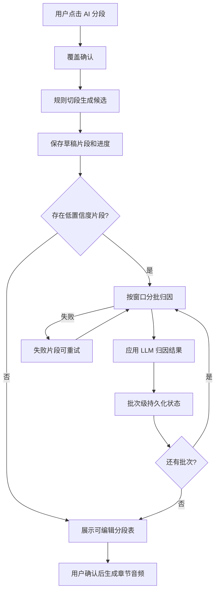
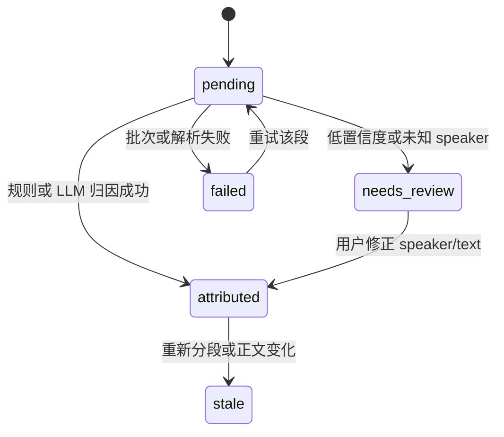

# feat: Optimize Audiobook Segmentation Pipeline

## Summary

本计划把章节丰盈中的「AI 分段」从整章一次性 LLM JSON 生成，改为规则切段、小窗口 LLM 说话人归因、分批进度展示和失败片段可重试的流水线。目标是在保留有声读物分段表可编辑、章节级生成和 VoiceBox 边界的前提下，显著降低长章节等待时间，并让失败可恢复、低置信度结果可人工修正。

---

## Problem Frame

当前点击「AI 分段」后，前端会把完整作品上下文和整章正文一次性发给非流式 AI 调用，直到模型返回完整 JSON 数组前 UI 只有按钮 loading。长章节或本地模型会造成长时间无反馈，且一次失败会让整章分段失败，不符合原始有声读物需求中“流程稳定、可编辑、可恢复”的成功标准。

---

## Requirements

- R1. 「AI 分段」必须先用本地规则从章节正文生成有序候选片段，至少区分旁白、显式说话人对白、低置信度对白和未识别片段。
- R2. 显式可判断的说话人应优先由规则归属；无法可靠判断的片段再进入小窗口 LLM 归因，避免整章一次性 LLM 分段。
- R3. LLM 归因请求必须限制在小窗口上下文和候选角色集合内，输出只负责补全或修正说话人、语气/情绪和置信度，不重写正文。
- R4. 分段过程必须展示批次级进度、当前阶段、已完成/失败数量，并在失败时保留已成功片段。
- R5. 每个分段必须持久化足够的来源定位、识别来源、置信度、状态和错误信息，支持失败片段或低置信度片段单独重试。
- R6. 现有分段表的人工复核能力必须保留；低置信度、未知 speaker、定位不可靠和失败片段必须在 UI 中可见并可修正。
- R7. 重新分段仍必须提示会覆盖当前编辑；已手动编辑的分段不应被后台批次静默覆盖。
- R8. 章节音频生成继续沿用当前 VoiceBox 代理、安全边界、提示词模板替换和每段音频生成逻辑；本计划只优化分段与 speaker 归因阶段。

**Origin actors:** A1 作者, A2 Story Matrix AI, A3 VoiceBox
**Origin flows:** F3 生成章节有声读物
**Origin acceptance examples:** AE4 editable segment review before TTS, AE5 Story Matrix prompt ownership, AE6 partial failure retry/playback

---

## Scope Boundaries

- 不重新实现 VoiceBox 系统配置、声音管理、用户声音资产、后端 VoiceBox 代理或音频播放下载。
- 不做整本有声书拼接、发布级后期、多轨混音或音效设计。
- 不引入训练型 NLP 模型、BookNLP、SPC 或本地 BERT 依赖；本轮采用零新依赖的规则层和现有 AI provider 小窗口调用。
- 不保证自动 speaker 归因 100% 正确；产品边界仍是“AI 初稿 + 人工复核后生成音频”。
- 不把低置信度片段自动阻塞全部分段完成；是否能生成音频由 speaker 绑定完整性和用户复核状态共同决定。
- 不在本计划内做跨章节批量分段或整本批处理；只优化单章「AI 分段」交互。

### Deferred to Follow-Up Work

- 训练或接入专门的中文小说说话人识别模型：等规则+小窗口 LLM 流水线稳定后再评估准确率瓶颈。
- 跨章节角色别名库和称谓解析：本轮可利用现有角色名称与章节涉及角色，不建设复杂别名管理。
- 分段任务后台队列或服务端持久任务：本轮优先在现有前端 hook 和作品 JSON 状态内实现可恢复体验。
- 自动质量评分报表：本轮只在 UI 上暴露低置信度和失败状态，不做统计仪表盘。

---

## Context & Research

### Relevant Code and Patterns

- `src/pages/chapters/ChapterAudiobookPanel.tsx` 当前承载章节丰盈内的有声读物面板，`AI 分段` 按钮只显示 Ant Design loading，没有分批进度或取消/重试入口。
- `src/features/audiobook/useAudiobook.ts` 当前 `segmentChapter()` 负责覆盖确认、构造 prompt、非流式调用 `generate()`、解析 JSON、标准化并保存分段；同一 hook 已有 `generateChapterAudio()` 的 segment 级状态和失败重试模式可借鉴。
- `src/ai/prompts/audiobook.ts` 当前 `buildAudiobookSegmentationPrompt()` 把完整 seed、world、characters、outline 和整章正文放进一次 prompt；这是长等待的主要来源。
- `src/features/audiobook/segmentUtils.ts` 当前只负责解析 AI JSON 和生成 `AudiobookSegment`，适合扩展为规则粗切、定位、合并和 LLM 结果应用的纯函数集合。
- `src/features/audiobook/promptTemplateUtils.ts` 已依赖 `sourceStartOffset` 定位“说话内容前三个段落”上下文；新分段结果必须继续提供可靠来源位置。
- `src/core/types.ts` 的 `AudiobookSegment` 和 `WorkAudiobookConfig` 是作品 JSON 内的持久化边界；新增字段应保持可选并通过 `src/core/store.ts` 做兼容迁移。
- `src/ai/client.ts` 已有 `generateStream()` 和 `generate()`；章节正文写作、世界观、角色等页面通过 `setAIStream()` 展示流式内容，但分段更适合展示结构化批次进度，而不是把 JSON 流直接塞进全局 AI 面板。
- `src/pages/preview/SegmentReviewTable.tsx` 已提供 speaker、文本、prompt/status 的可编辑表格，并已分页；应扩展状态/置信度/错误展示，而不是新建独立复核界面。
- `test/audiobook.test.mjs` 以源码断言锁定有声读物架构边界；本计划应补充分段流水线、低置信度、批次进度、单段重试等行为约束。

### Institutional Learnings

- `docs/brainstorms/voicebox-audiobook-requirements.md` 明确章节分段必须在 TTS 前展示给用户编辑，AI 自动识别 speaker 必然会出错，流程稳定优先于发布级成品质量。
- `docs/plans/2026-06-11-001-feat-voicebox-audiobook-generation-plan.md` 已把分段脚本持久化在作品数据里，并要求长章节多分段生成可恢复；本计划把同样的恢复原则前移到分段阶段。
- `docs/plans/2026-06-12-001-feat-voicebox-user-sound-management-plan.md` 已将分段阶段的职责收敛为 speaker/text/mood/source location，最终 `instruct` 在生成音频前由模板填充；新分段流水线应保留这个职责分离。

### External References

- 小说 quote attribution 常见工程形态是“引号/对白抽取 -> 候选角色 -> 上下文归因 -> 人工复核”，而不是一次性整章 LLM 分段。
- 中文小说 speaker/addressee 研究通常用前后若干句作为上下文窗口，并限定候选角色；这支持本计划的小窗口归因策略。
- 开源有声书工具常见做法包括 LLM script annotation 后再 review/fix pass，以及 review-before-render 的人工修正界面；这支持继续保留分段表作为生成前关口。

---

## Key Technical Decisions

- 用本地规则生成第一版片段骨架：规则层低延迟、可测试、无 API 成本，可立即解决“点击后完全无反馈”的体验问题，并减少 LLM 需要处理的文本量。
- LLM 只处理低置信度或需要语义判断的窗口：显式“某某说/问/道”不再送整章模型判断，避免用最慢路径处理最简单情况。
- 将分段过程建模为批次任务而不是单次请求：批次状态能让 UI 展示进度、保留成功结果、定位失败批次，并支持仅重试失败或低置信度片段。
- 继续把分段结果持久化在 `Work.audiobook.segmentsByChapter`：这是既有章节音频生成、人工编辑和刷新恢复的边界；新增状态字段应向后兼容旧 segment。
- 低置信度不是失败：低置信度片段应在表格中提示用户复核，但不应丢弃原文或阻塞整章分段完成。
- 单段重试以“重跑归因”为主，不重新规则切全章：用户修正后的片段文本和来源位置是更小、更可控的重试单位。
- 不复用全局 `AIPanel` 承载结构化分段进度：分段进度属于章节有声读物面板内的任务状态，使用本地进度条/状态列表更贴近用户当前操作。
- 保留现有 AI provider 配置，不新增外部 NLP 依赖：降低部署和维护成本，适合当前 React + Express + SQLite + IndexedDB 的本地产品形态。

---

## Open Questions

### Resolved During Planning

- 是否保留整章一次性 LLM 分段作为主路径？否。它是当前长等待根因，应退为可选兜底或移除主流程。
- 是否引入 BookNLP/SPC/BERT 模型？否。本轮优先用规则 + 小窗口 LLM，在不增加部署依赖的前提下改善体验。
- 是否把分段任务移到后端队列？否。本轮用现有前端状态和作品持久化实现批次进度；服务端队列留待整本批处理或多用户并发压力出现后再规划。
- 是否让低置信度片段阻止保存？否。分段初稿应可保存并展示，用户复核后再生成音频。

### Deferred to Implementation

- 规则切段的精确正则集合：实现阶段用测试样例锁定中文引号、冒号、说话动词、内心独白和 Markdown 段落边界。
- 单批窗口大小和重叠范围：实现阶段根据 token 预算和常见章节长度选择默认值，并保留易调整常量。
- LLM 输出 schema 的字段命名：实现阶段在 prompt 和解析函数中确定，但必须覆盖 speaker、mood、confidence 和 failure reason 等语义。
- 是否暴露“取消分段”按钮：计划允许状态模型支持取消，但如果实现成本超出本轮，可先提供批次失败/重试和刷新恢复。

---

## High-Level Technical Design

> *This illustrates the intended approach and is directional guidance for review, not implementation specification. The implementing agent should treat it as context, not code to reproduce.*





---

## Implementation Units

### U1. 扩展分段状态与兼容迁移

**Goal:** 为分段流水线增加可持久化的识别来源、置信度、批次、错误和复核状态，同时保持旧作品可加载。

**Requirements:** R4, R5, R6, R8; supports F3 and AE4.

**Dependencies:** None.

**Files:**
- Modify: `src/core/types.ts`
- Modify: `src/core/store.ts`
- Modify: `src/features/audiobook/segmentUtils.ts`
- Test: `test/audiobook.test.mjs`

**Approach:**
- 扩展 `AudiobookSegment` 的可选字段，表达分段来源、speaker 归因来源、置信度、批次 ID、错误信息、是否需要复核和可重试状态。
- 保持现有 `status` 对音频生成状态的兼容，避免分段阶段和音频阶段争用同一个状态语义；如需要新增分段状态，使用可选字段而不是破坏 `ChapterAudioStatus`。
- 在 `migrateWork()` 中为旧 segment 补齐默认识别来源和可用来源位置，不删除既有 `generationId`、`prompt`、`sourceStartOffset`。
- 让缺少来源位置的旧分段继续可编辑，但在生成前仍由现有定位校验提示重新分段或手动修正。

**Execution note:** 先补充源码断言或轻量单元测试，锁住旧作品加载和字段兼容，再改类型与迁移。

**Patterns to follow:**
- `src/core/store.ts` 现有 audiobook 迁移以可选字段补齐旧数据。
- `src/core/types.ts` 现有 `AudiobookSegment` / `WorkAudiobookConfig` 作为作品 JSON 持久化边界。

**Test scenarios:**
- Happy path: 旧 segment 没有新增字段时，加载作品后仍保留 speaker、text、sourceStartOffset 和 generationId。
- Happy path: 新 segment 可记录规则来源、LLM 来源、置信度和 batch ID。
- Edge case: 旧 segment 缺少 sourceStartOffset 时，不因迁移报错，并保留为需要重新定位的可编辑分段。
- Error path: 新增分段字段不能要求非空导致 TypeScript 旧数据路径无法构造默认 audiobook。
- Integration: 现有章节音频生成读取旧 segment 时仍能进入缺绑定/缺模板等既有校验路径。

**Verification:**
- 旧作品数据迁移不丢有声读物状态。
- 新分段状态字段可支持进度、复核和重试，不破坏现有音频生成字段。

### U2. 实现规则切段与显式说话人归属

**Goal:** 用纯函数从章节正文快速生成分段候选，优先处理显式说话人和旁白，减少 LLM 工作量。

**Requirements:** R1, R2, R5, R6; covers AE4.

**Dependencies:** U1.

**Files:**
- Modify: `src/features/audiobook/segmentUtils.ts`
- Create: `src/features/audiobook/segmentRules.ts`
- Test: `test/audiobook.test.mjs`

**Approach:**
- 按 Markdown 段落和中文标点切出稳定文本单元，保留每个单元在章节正文中的起止位置。
- 识别中文/英文引号、冒号引导对白、后置说话提示语和常见说话动词，生成旁白与对白候选。
- 将“显式角色名 + 说话动词”的片段直接映射到作品角色；无法唯一匹配时标记为低置信度，交给 LLM 或用户复核。
- 保留原文文本，不改写、不补写；规则层只负责切分、定位、候选 speaker 和置信度。
- 避免过度切碎连续旁白；相邻同 speaker、同来源且短文本可在规则层合并为更适合 TTS 的片段。

**Technical design:** *(directional guidance, not implementation specification.)*

```text
Rule segment candidates:
- narrator text outside quotation spans
- quote span with explicit preposed cue: 角色道：“……”
- quote span with explicit postposed cue: “……”，角色道
- quote span with no reliable cue: needs_review / needs_llm
```

**Patterns to follow:**
- `src/features/audiobook/promptTemplateUtils.ts` 的 paragraph offset 计算风格。
- `src/features/audiobook/segmentUtils.ts` 当前 normalizeSegments 的 sourceStartOffset 语义。

**Test scenarios:**
- Happy path: `林舟道：“走吧。”` 被切为角色对白，speaker 映射到同名角色，旁白不混入 text。
- Happy path: `“走吧。”林舟低声说。` 被识别为后置提示语对白。
- Happy path: 普通叙述段落被归为旁白，并保留正确 sourceStartOffset。
- Edge case: 连续两句同一角色对白可保持顺序，并不把说话提示语读入 VoiceBox text。
- Edge case: 中文书名号、Markdown 标题、空行不应被误判为对白。
- Edge case: 角色重名或候选不唯一时标记低置信度，而不是随便选一个 speaker。
- Error path: 引号不闭合时生成保守分段并标记需要复核，不丢失原文。
- Integration: 规则结果进入现有 SegmentReviewTable 后，speaker 下拉仍可人工修正。

**Verification:**
- 常见中文小说对白无需调用 LLM 就能得到可复核分段初稿。
- 所有规则切出的片段都能追溯到章节正文位置。

### U3. 设计小窗口 LLM 归因 prompt 与解析

**Goal:** 让 LLM 只处理低置信度片段所在的小窗口，补全 speaker/mood/confidence，不再整章输出分段 JSON。

**Requirements:** R2, R3, R5, R6; covers AE4 and AE5.

**Dependencies:** U1, U2.

**Files:**
- Modify: `src/ai/prompts/audiobook.ts`
- Modify: `src/features/audiobook/segmentUtils.ts`
- Test: `test/audiobook.test.mjs`

**Approach:**
- 新增归因 prompt builder，只输入待归因片段、前后少量原文上下文、章节标题/大纲摘要、候选角色列表和规则层已有猜测。
- 候选角色优先来自章节大纲涉及角色、规则窗口出现的角色名、已绑定声音角色和旁白；全作品角色只作为必要兜底，避免候选过多。
- LLM 输出只允许引用候选 speaker，不允许改写 `text`；如果无法判断，应返回旁白或需要复核，而不是幻想角色。
- 解析函数需容忍 markdown fence 和部分格式噪音，但失败时只影响当前批次或片段。
- 归因结果应用时只更新 speaker、mood、confidence、source 字段，不覆盖用户已编辑文本。

**Patterns to follow:**
- `src/ai/prompts/audiobook.ts` 已有严格 JSON prompt 风格。
- `src/pages/chapters/ChaptersPage.tsx` 事件提取对 AI JSON 的容错解析经验。
- `src/features/audiobook/segmentUtils.ts` 纯函数化 parse/normalize 边界。

**Test scenarios:**
- Happy path: 低置信度对白在候选角色中被 LLM 归属为角色，并写入 confidence 和 mood。
- Happy path: LLM 返回 narrator 时，分段保持旁白 speakerKind 且不要求角色绑定。
- Edge case: LLM 返回不在候选列表中的角色时，该片段标记需要复核而不是接受非法 characterId。
- Edge case: LLM 返回缺 mood 时，使用安全默认值并保留 speaker 归因。
- Error path: LLM JSON 解析失败时，只把当前批次片段标记 failed，不清空规则层已保存片段。
- Error path: LLM 修改了 text 字段时，实现忽略 text 改写，仅应用归因字段。
- Integration: 小窗口 prompt 不包含完整世界观、完整大纲和整章正文。

**Verification:**
- LLM 调用的输入规模随低置信度片段窗口增长，而不是随整章和全作品上下文线性膨胀。
- 非法或失败 LLM 输出不会污染已成功的规则分段。

### U4. 编排分批分段任务与进度状态

**Goal:** 将 `segmentChapter()` 改造成可展示进度、逐批持久化、失败可恢复的分段任务。

**Requirements:** R4, R5, R7; covers AE4 and AE6.

**Dependencies:** U1, U2, U3.

**Files:**
- Modify: `src/features/audiobook/useAudiobook.ts`
- Modify: `src/features/audiobook/segmentUtils.ts`
- Test: `test/audiobook.test.mjs`

**Approach:**
- 保留已有覆盖确认流程；确认后先运行规则切段并立即保存草稿，让用户尽快看到可编辑分段。
- 将需要 LLM 的片段按窗口分批，串行或小并发处理；每批完成后更新本章分段和任务进度。
- 任务状态应包含阶段、总批次数、已完成批次、失败批次、当前说明和可重试片段数量。
- 批次失败不回滚已成功批次；最终展示“部分完成/需重试/需复核”而不是整章失败。
- 避免任务运行期间用户编辑被后续批次覆盖：对已被用户修改的 segment，只更新未编辑的归因字段或跳过自动覆盖。
- 分段任务结束后清理 loading 状态；异常路径必须确保 UI 不会永久停留在 segmenting。

**Technical design:** *(directional guidance, not implementation specification.)*

```text
Segmentation stages:
1. validating
2. rule_splitting
3. saving_draft
4. attributing_batches
5. completed | partial_failed | failed
```

**Patterns to follow:**
- `src/features/audiobook/useAudiobook.ts` 的 `generateChapterAudio()` 逐 segment 保存状态和 retryFailedOnly 模式。
- `src/pages/chapters/ChaptersPage.tsx` 长时间 AI 操作在 catch/finally 中清理 UI 状态的模式。
- `src/core/db.ts` / `src/core/store.ts` 当前 work JSON 更新边界。

**Test scenarios:**
- Happy path: 一章含显式对白和隐式对白时，规则草稿先保存，LLM 批次随后补全低置信度 speaker。
- Happy path: 所有批次完成后，分段表显示 completed/needs_review 状态和可编辑 speaker。
- Edge case: 章节没有需要 LLM 的片段时，不发起 AI 请求，直接完成分段。
- Edge case: 重新分段时用户取消覆盖确认，既有分段和音频状态不变。
- Error path: 第二批 LLM 失败时，第一批结果保留，失败片段可重试。
- Error path: AI 配置缺失时，规则切段是否运行需遵守产品决策；若需要 LLM 才能完成，提示配置 AI 且不进入假完成状态。
- Integration: 分段任务持久化后刷新页面，已保存草稿和失败状态仍可在章节面板中看到。

**Verification:**
- 用户不再面对长时间只有按钮转圈的分段流程。
- 分段阶段的失败可以定位到批次或片段，并可继续编辑或重试。

### U5. 扩展章节有声读物面板的进度和重试交互

**Goal:** 在章节丰盈中展示分段进度、低置信度提示和每段/失败批次重试入口。

**Requirements:** R4, R5, R6, R7; covers AE4 and AE6.

**Dependencies:** U1, U4.

**Files:**
- Modify: `src/pages/chapters/ChapterAudiobookPanel.tsx`
- Modify: `src/pages/preview/SegmentReviewTable.tsx`
- Modify: `src/features/audiobook/useAudiobook.ts`
- Test: `test/audiobook.test.mjs`

**Approach:**
- 在有声读物面板内展示分段任务的阶段、进度条、完成/失败数量和当前批次说明。
- 在表格中增加低置信度、失败、规则/LLM 来源和需要复核的视觉标记；保持分页，避免长章节表格展开性能退化。
- 为失败或需要复核的片段提供重试归因入口；重试前不覆盖用户编辑过的 text。
- 当分段任务运行中，禁用会造成状态冲突的重新分段和生成音频操作；仍允许查看已保存片段。
- 生成章节音频前，如果存在未知 speaker 或失败片段，应提示用户先修正或重试；低置信度但已绑定 speaker 的片段可由用户决定是否继续。
- 保留“重新分段会覆盖当前编辑”的确认文案，并在存在手动编辑时更明确提示覆盖风险。

**Patterns to follow:**
- `src/pages/chapters/ChapterAudiobookPanel.tsx` 当前按钮与 Alert 组合。
- `src/pages/preview/SegmentReviewTable.tsx` 现有 Select/TextArea/Tag 表格结构和分页。
- `src/pages/preview/ChapterAudioPlayer.tsx` 只在有 completed segments 时加载音频的惰性模式。

**Test scenarios:**
- Happy path: 分段运行中面板显示批次进度，而不是只有 AI 分段按钮 loading。
- Happy path: 低置信度片段在表格中显示需要复核标记，并允许用户改 speaker。
- Happy path: 失败片段显示错误原因和重试入口。
- Edge case: 分段任务运行中点击生成章节音频被禁用或阻止。
- Edge case: 长章节 50+ 分段时表格仍分页展示，不一次渲染全部 textarea。
- Error path: 未知 speaker 的片段阻止音频生成，并提示先修正 speaker。
- Integration: 用户修正低置信度 speaker 后，缺少音色绑定的提示按新 speaker 重新计算。

**Verification:**
- 用户能看见分段进行到哪一步、哪些片段需要处理、哪些片段可以重试。
- 分段 UI 与现有章节音频生成按钮状态不冲突。

### U6. 加固 AI 代理参数与超时边界

**Goal:** 修复 AI 请求参数未完整转发和长连接无服务端超时的问题，降低分段批次卡死风险。

**Requirements:** R3, R4; supports AE6.

**Dependencies:** None.

**Files:**
- Modify: `src/ai/client.ts`
- Modify: `server/src/routes/ai.ts`
- Test: `test/model-config.test.mjs`
- Test: `test/audiobook.test.mjs`

**Approach:**
- 后端 `/api/ai/chat-completions` 接收并转发安全的 OpenAI-compatible generation 参数，至少包括当前前端已发送但未转发的最大输出 token。
- 为后端转发到上游 AI provider 的请求增加服务端超时，避免浏览器 abort 后服务端仍长时间悬挂。
- 保持现有 server-configured API key 逻辑和凭据不泄露边界，不把 AI 密钥回传浏览器。
- 分段小窗口调用应设置更小的输出预算，避免单批归因 runaway；章节写作等现有流式功能仍使用用户配置默认值。
- 错误信息应能区分 provider 错误、超时和解析失败，供分段 UI 显示可重试原因。

**Patterns to follow:**
- `src/ai/client.ts` 现有 `generate()` / `generateStream()` 请求形态。
- `server/src/routes/ai.ts` 当前 `loadSystemAIConfig()` 和 providerHeaders 安全边界。
- `test/model-config.test.mjs` 现有模型配置代理断言。

**Test scenarios:**
- Happy path: 管理后台配置的 max token 会被后端代理转发给上游 provider。
- Happy path: 小窗口分段调用可以覆盖更小输出预算，不影响普通章节写作流。
- Edge case: max token 为 0 或未设置时，不发送无效参数。
- Error path: 上游 AI 超时返回可解释错误，前端不会永久处于 loading。
- Error path: 上游 provider 返回非 2xx 时，错误消息仍通过现有格式传回。
- Integration: server-configured API key 模式下，前端请求不携带真实 key，后端仍能转发参数。

**Verification:**
- 分段批次不会因为后端无限等待而卡死。
- AI 参数转发与现有安全边界同时成立。

### U7. 更新测试与中文文档

**Goal:** 用测试和文档锁住新的分段流水线，防止回退到整章非流式 LLM 分段。

**Requirements:** R1-R8; covers AE4, AE5, AE6.

**Dependencies:** U1-U6.

**Files:**
- Modify: `test/audiobook.test.mjs`
- Modify: `test/model-config.test.mjs`
- Modify: `README.md`
- Modify: `docs/voicebox-integration.md`
- Modify: `docs/plans/2026-06-12-001-feat-voicebox-user-sound-management-plan.md`

**Approach:**
- 扩展 audiobook 测试，断言分段流程包含规则切段、小窗口归因、批次进度、低置信度标记和失败片段重试，不再依赖整章 `buildAudiobookSegmentationPrompt()` 主路径。
- 更新模型配置测试，覆盖 max token 转发和服务端超时边界。
- README 和 VoiceBox 文档说明新的使用路径：AI 分段会先生成可编辑初稿，低置信度需要复核，失败片段可重试。
- 在上一份 VoiceBox 二期计划中追加 superseded/extension note，说明本计划替换其中“AI 分段一次性生成”的实现方式，但不改变声音管理和模板生成边界。
- 文档避免承诺自动 speaker 归因完全准确，强调“分段表复核后再生成音频”。

**Patterns to follow:**
- `test/audiobook.test.mjs` 现有架构边界源码断言。
- `README.md` 当前中文 VoiceBox 使用流程。
- `docs/voicebox-integration.md` 当前排障和使用步骤结构。

**Test scenarios:**
- Happy path: 测试确认规则分段工具存在并被 `segmentChapter()` 主流程调用。
- Happy path: 测试确认 LLM 归因 prompt 不包含完整世界观、完整大纲和整章正文。
- Happy path: 测试确认 UI 显示分段进度和失败重试入口。
- Error path: 测试确认整章分段失败不会清空已有可用分段，除非用户确认重新分段覆盖。
- Integration: 测试确认 README 中 VoiceBox 流程描述包含“检查分段表、低置信度复核、失败片段重试”。

**Verification:**
- `npm run test:audiobook` 和 `npm run test:model-config` 覆盖新的架构不变量。
- 用户文档不再描述「AI 分段」为一次整章等待的黑盒操作。

---

## System-Wide Impact

- **Interaction graph:** 章节有声读物面板、作品 audiobook JSON、AI provider、分段表、提示词模板填充和 VoiceBox 音频生成会形成新的两阶段流程：先分段归因，后人工复核并生成音频。
- **Error propagation:** 规则切段失败、LLM 批次失败、JSON 解析失败、未知 speaker、低置信度、AI 超时和用户取消覆盖都必须落到可理解的 UI 状态，不能只弹一次 toast 后丢状态。
- **State lifecycle risks:** 分段任务会多次写入同一章节 segments；必须避免覆盖用户在批次运行期间的手动编辑，也要避免刷新后丢失已完成批次。
- **Performance:** 规则切段应在本地快速完成；LLM 调用数量随低置信度片段数量增长，需要窗口大小、批次数和输出 token 有上限。
- **API surface parity:** 浏览器仍只访问 Story Matrix AI 后端；AI provider 密钥和 VoiceBox 凭据边界不变。
- **Integration coverage:** 关键端到端场景是：章节有正文 -> AI 分段立即出现规则草稿 -> LLM 批次补全隐式对白 -> 用户修正低置信度片段 -> 缺绑定校验 -> 生成章节音频 -> 失败片段可重试。
- **Unchanged invariants:** 声音管理、角色声音绑定、旁白全局配置、QwenTTS 模板占位符替换、VoiceBox 音频代理播放和章节正文写作流必须保持现有行为。

---

## Risks & Dependencies

| Risk | Mitigation |
|------|------------|
| 中文小说对白格式多样，规则切段漏判或误判 | 规则层只生成初稿并标记置信度；低置信度进入 LLM 或人工复核 |
| 小窗口 LLM 缺少全局上下文导致隐式 speaker 归因错误 | 候选角色来自章节、邻近角色名和已绑定角色；保留低置信度标记，不强行自动确认 |
| 批次运行时用户编辑导致后续自动结果覆盖 | 为 segment 记录编辑状态或更新策略，批次应用时跳过用户已编辑字段 |
| 分段状态字段膨胀让 Work JSON 变大 | 只保存必要状态和错误摘要，不保存完整 prompt/响应；整本批处理和专表存储延后评估 |
| 后端 AI 代理参数转发影响其他 AI 功能 | 只转发白名单参数，并用现有模型配置测试覆盖默认和覆盖行为 |
| 低置信度片段是否允许继续生成音频可能让用户困惑 | UI 明确标记“建议复核”，未知 speaker/失败阻止生成，已归属低置信度由用户决策 |
| 规则初稿立即保存后，重新分段覆盖语义更复杂 | 保留覆盖确认，文案说明会替换当前分段编辑和分段进度 |

---

## Documentation / Operational Notes

- README 的 VoiceBox 使用流程需要补充：AI 分段先给出可编辑初稿，系统会标记低置信度和失败片段，用户复核后再生成章节音频。
- `docs/voicebox-integration.md` 的“生成章节音频”步骤需要从“点击 AI 分段后等待结果”改为“查看分批进度、处理低置信度/失败片段”。
- 上一份 VoiceBox 二期计划应标注：本计划替换 AI 分段实现策略，但不改变声音管理、章节入口和提示词模板决策。
- 如果实现阶段发现本地规则对某类作品误判明显，应优先增加测试样例和低置信度标记，而不是扩大自动确认范围。

---

## Sources & References

- **Origin document:** `docs/brainstorms/voicebox-audiobook-requirements.md`
- **Extends:** `docs/plans/2026-06-12-001-feat-voicebox-user-sound-management-plan.md`
- **Previous plan:** `docs/plans/2026-06-11-001-feat-voicebox-audiobook-generation-plan.md`
- Related code: `src/pages/chapters/ChapterAudiobookPanel.tsx`
- Related code: `src/features/audiobook/useAudiobook.ts`
- Related code: `src/features/audiobook/segmentUtils.ts`
- Related code: `src/features/audiobook/promptTemplateUtils.ts`
- Related code: `src/ai/prompts/audiobook.ts`
- Related code: `src/ai/client.ts`
- Related code: `server/src/routes/ai.ts`
- Related code: `src/pages/preview/SegmentReviewTable.tsx`
- Related code: `src/core/types.ts`
- Related code: `src/core/store.ts`
- Related code: `test/audiobook.test.mjs`
- External research: `https://aclanthology.org/2024.sighan-1.1/`
- External research: `https://arxiv.org/html/2408.09452`
