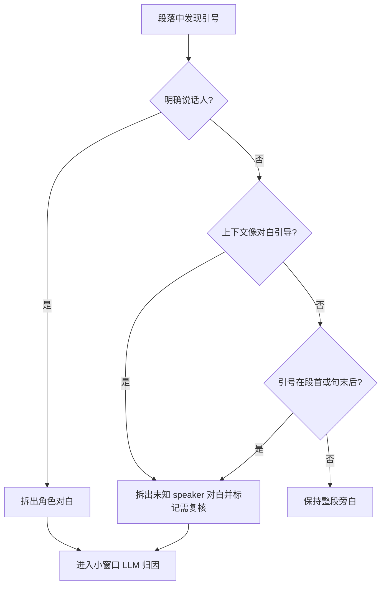

# fix: Preserve Quoted Dialogue in Audiobook Segmentation

## Summary

本计划聚焦修复「AI 分段」规则层对中文小说“动作/语气叙述 + 引号对白”的漏拆问题：引号内真实对白应被切成独立低置信度对白片段进入小窗口归因，而不是因为引号前没有句号或显式“某某说”就把整段保存为旁白。

---

## Problem Frame

现有 `createRuleBasedSegments()` 只有在检测到明确说话人、引号位于段首，或引号前已经是句末标点时才拆分引号内容。用户给出的两个失败样例都属于中文小说常见写法：前半句描述角色声音、表情或动作，随后直接接引号对白，因此当前规则会触发“没有任何可拆引号”的保守分支，把整段归为旁白。

这个问题违反既有分段流水线计划的核心边界：规则层应至少把疑似对白保留下来作为可复核候选，未知 speaker 再交给 LLM 归因或人工修正，而不是在第一步就把对白吞进旁白。

---

## Assumptions

*This plan was authored without synchronous user confirmation. The items below are agent inferences that fill gaps in the input — un-validated bets that should be reviewed before implementation proceeds.*

- 用户期望修复的是单章「AI 分段」规则切段结果，而不是改 Voicebox 音频生成、声音绑定或分段表保存交互。
- 对这类“叙述引出对白但未能规则识别 speaker”的片段，正确产品行为是拆出对白并标记低置信度/需复核，而不是强行自动指定角色。
- 本轮应优先补规则层和测试，不引入外部 NLP 依赖，也不扩大到整套说话人识别算法重写。

---

## Requirements

- R1. 用户给出的两个中文段落在规则分段后必须至少拆成旁白引导片段和引号内对白片段，不能整体归为旁白。
- R2. 当引号前是角色声音、动作、表情、姿态、视线等叙述性提示，但没有明确“说/问/道”归属时，引号内容应作为低置信度对白候选保存。
- R3. 未识别 speaker 的对白候选必须保留原文、来源位置、`needsReview`、`retryable` 和低置信度标记，以便后续小窗口 LLM 归因或用户手动修正。
- R4. 规则层仍必须避免把书名号、术语引用、反讽词、短引用词等非对白误拆成需要角色声音的片段。
- R5. 修复不能改变已有显式说话人识别、段首对白、后置说话提示语、分段表复核和章节音频生成行为。

**Origin actors:** A1 作者, A2 Story Matrix AI, A3 Voicebox
**Origin flows:** F3 生成章节有声读物
**Origin acceptance examples:** AE4 分段表在 TTS 前可编辑, AE5 Story Matrix 维护语气提示词, AE6 失败片段可恢复和重试

---

## Scope Boundaries

- 不重做 Voicebox 系统配置、声音管理、后端 Voicebox 代理、音频生成或播放下载。
- 不改动分段表的行级保存、显式保存按钮、字段级 patch 或未保存草稿阻断规则。
- 不引入 BookNLP、BERT、SPC 或其他中文小说说话人识别依赖；本轮继续沿用零新增依赖的规则层 + 小窗口 LLM 归因流水线。
- 不承诺自动 speaker 归因完全正确；未知 speaker 的对白应进入复核/归因流程。
- 不把所有带引号文本都视为对白；非对白引用仍应尽量保守保留在旁白中。

### Deferred to Follow-Up Work

- 更完整的中文小说对白语法库：若后续继续发现大量漏判/误判，再单独规划规则词库、角色别名和上下文评分。
- 真实 AST/运行级单元测试迁移：当前测试以源码断言为主，本轮可先补架构断言和必要的轻量可执行测试，后续再考虑引入正式测试运行器。

---

## Context & Research

### Relevant Code and Patterns

- `src/features/audiobook/segmentRules.ts` 是当前规则切段入口，`QUOTE_PATTERN` 抽取引号，`detectSpeaker()` 识别前置/后置“角色 + 说话动词”，`shouldSplitQuote()` 决定是否拆出引号文本。
- `src/features/audiobook/segmentRules.ts` 当前 `shouldSplitQuote()` 对无 speaker 的中句引号只在引号前以 `。.!！?？` 结尾时拆分；用户样例中引号前分别是逗号和冒号，因此会整段旁白化。
- `src/features/audiobook/useAudiobook.ts` 的 `segmentChapter()` 已先调用 `createRuleBasedSegments()` 保存草稿，再把 `segmentsNeedingAttribution()` 返回的低置信度片段送入 `attributeSegmentBatch()`。
- `src/features/audiobook/segmentUtils.ts` 的 `applyAttributionResults()` 已能把 LLM 归因结果应用到低置信度片段，并在非法角色、低置信度时保持 `needsReview`。
- `src/pages/chapters/ChapterAudiobookPanel.tsx` 和 `src/pages/preview/SegmentReviewTable.tsx` 已显示低置信度、归因失败、重试归因和人工修正入口，本轮不需要新建 UI。
- `test/audiobook.test.mjs` 是当前有声读物的源码级架构断言文件，已读取 `segmentRules.ts` 并断言 `QUOTE_PATTERN`、`shouldSplitQuote()`、规则草稿和小窗口归因存在。

### Institutional Learnings

- `docs/brainstorms/voicebox-audiobook-requirements.md` 明确章节切分必须至少区分旁白和角色台词，且 AI 自动识别 speaker 必然会出错，用户必须能在生成音频前修正。
- `docs/plans/2026-06-15-002-feat-audiobook-segmentation-pipeline-plan.md` 已决定规则层先生成候选片段，显式 speaker 由规则归属，低置信度对白进入小窗口 LLM 归因。
- `docs/plans/2026-06-16-001-refactor-audiobook-row-save-plan.md` 已要求 AI 分段和归因批次不能覆盖用户编辑；本修复必须保持这种字段所有权边界。
- `CLAUDE.md` 要求接口开发优先传最小内容；本修复只涉及本地规则切段和既有小窗口归因，不增加整章大 payload。

### External References

- 未使用外部资料。该缺陷由本地正则与分段门控条件决定，现有代码和既有 Voicebox 计划足以制定修复方案。

---

## Key Technical Decisions

- 将“是否拆引号”从单一 `speaker || 段首 || 句末标点` 扩展为“明确 speaker 直接归属；疑似对白但 speaker 未知则拆出并低置信度归因；非对白引用继续保守不拆”。这样符合已有流水线的“规则草稿 + LLM 归因 + 人工复核”设计。
- 先补用户给出的两个回归样例，再调整规则。当前缺陷很具体，测试应锁住真实中文句式，而不是只断言函数名存在。
- 不让规则层凭“神代司的声音”“千叶雏盯着他”直接自动归属角色。声音/动作叙述提示“这像对白”，但不一定足以证明 speaker；低置信度归因更安全。
- 把非对白引用防误拆作为同等测试目标。否则简单改成“有引号就拆”会提升用户样例，但会把术语引用、书名引用和强调引用变成错误的角色台词。
- 保持来源 offset 精确到原文引号内文本。后续提示词上下文、播放生成和用户编辑都依赖 `sourceStartOffset` / `sourceEndOffset` 能定位到章节正文。

---

## Open Questions

### Resolved During Planning

- 是否需要改 UI？否。现有面板已显示低置信度、待复核和重试归因；缺陷在规则层没有把对白候选交给这些机制。
- 是否需要外部 NLP 库？否。样例属于规则门控过窄，零新增依赖即可修复。
- 是否应把未知 speaker 自动判给引号前最近角色名？否。角色名可能出现在受话人、动作对象或叙述主体中，自动归属风险高；本轮只保证不吞对白。

### Deferred to Implementation

- 疑似对白启发式的最终词表：实现阶段根据测试决定覆盖“声音/语气/嘴唇/盯着/颤抖/轻声/矜持”等提示词的最小集合，不在计划里预写完整正则。
- 非对白引用的负例集合：实现阶段应从现有内容和新增测试中补足书名号、术语短引、反讽词等场景。
- 可执行测试方式：若当前源码断言不足以验证真实输出，实施阶段可新增轻量 `.mjs` 测试直接调用纯函数，或在不引入新依赖前提下复用现有测试脚本模式。

---

## High-Level Technical Design

> *This illustrates the intended approach and is directional guidance for review, not implementation specification. The implementing agent should treat it as context, not code to reproduce.*



---

## Implementation Units

### U1. 锁定中文引号对白回归样例

**Goal:** 先用测试明确用户给出的两类句式应被拆出对白候选，防止实现只改表面条件但没覆盖真实问题。

**Requirements:** R1, R2, R3, R5; covers AE4.

**Dependencies:** None.

**Files:**
- Modify: `test/audiobook.test.mjs`
- Test: `test/audiobook.test.mjs`

**Approach:**
- 在现有 audiobook 测试中增加针对 `segmentRules.ts` 行为的断言，优先覆盖用户提供的两个完整中文段落。
- 测试应验证输出中存在独立引号内文本片段，而不是只验证源码包含某个新正则。
- 对未知 speaker 的对白片段断言 `speakerKind` 保守为 `narrator` 或等价未知状态、`needsReview` 为真、置信度低于自动确认阈值，并且 `retryable` 为真。
- 如果现有 `.mjs` 测试难以直接导入 TypeScript 纯函数，可先用源码断言锁住关键策略，同时在 U2 实现时提取更易测试的纯 helper。

**Execution note:** 先写失败测试或源码断言，再改 `segmentRules.ts`。

**Patterns to follow:**
- `test/audiobook.test.mjs` 已集中读取相关源码并断言有声读物架构边界。
- `docs/plans/2026-06-15-002-feat-audiobook-segmentation-pipeline-plan.md` 对低置信度对白的测试场景描述。

**Test scenarios:**
- Happy path: `神代司的声音温和得像是在读一份医学报告，没有任何起伏，“……”` 生成旁白引导片段和引号内对白片段。
- Happy path: `千叶雏死死地盯着他，嘴唇颤抖着，声音虽轻却带着一种刻在骨子里的矜持：“……”` 生成旁白引导片段和引号内对白片段。
- Edge case: 两个样例中的对白片段保留省略号、句号和原始文字，不把引号外叙述拼入 Voicebox `text`。
- Integration: 新增测试仍通过 `npm run test:audiobook` 覆盖，且不要求真实 AI 或 Voicebox 服务。

**Verification:**
- 测试能在当前实现上暴露“整段旁白化”的问题，修复后通过。

### U2. 扩展疑似对白拆分启发式

**Goal:** 调整 `shouldSplitQuote()` 周边规则，让中文“叙述引出对白”被拆为低置信度对白候选，同时保留非对白引用的保守路径。

**Requirements:** R1, R2, R3, R4, R5.

**Dependencies:** U1.

**Files:**
- Modify: `src/features/audiobook/segmentRules.ts`
- Test: `test/audiobook.test.mjs`

**Approach:**
- 将 `shouldSplitQuote()` 的判定拆成更可读的 helper：明确 speaker、段首、句末边界、冒号引导、动作/声音/表情/视线提示等分别表达。
- 对“引号前是冒号或中文逗号 + 声音/动作/情绪提示”的文本，拆出引号内容，但因 speaker 未明确而使用低置信度 `needsReview`。
- 保持现有 `detectSpeaker()` 优先级：如果能唯一匹配角色和说话动词，仍直接归为角色对白。
- 继续让明显非对白引用留在旁白里，例如短术语引用、作品名引用、没有人称/动作/发声提示的解释性引号。
- 避免在规则层引入全局状态或 AI 调用；该文件应保持纯规则、可测试、低延迟。

**Technical design:** *(directional guidance, not implementation specification.)*

```text
Split quote when any high-level condition holds:
- reliable explicit speaker cue
- quote starts the unit
- quote follows a sentence boundary
- quote follows a dialogue-introducing colon
- nearby narration contains voice/action/emotion cues that strongly imply upcoming speech

If no explicit speaker is found, create the quote segment as needs-review low-confidence dialogue candidate.
```

**Patterns to follow:**
- `src/features/audiobook/segmentRules.ts` 现有 `detectSpeaker()` / `createSegment()` 分层。
- `src/features/audiobook/segmentUtils.ts` 对低置信度归因的状态字段约定。

**Test scenarios:**
- Happy path: 明确 `角色道：“……”` 仍直接生成 character 片段，不退化为未知 speaker。
- Happy path: 冒号前出现声音/动作提示时，引号内文本拆成低置信度候选。
- Happy path: 逗号前出现声音/表情提示时，引号内文本拆成低置信度候选。
- Edge case: `他把这称为“伦理坚守”。` 这类术语引用不应被强制拆成对白。
- Edge case: 多个引号混合时，只有符合对白提示的引号被拆，cursor 和 tail 不丢文本。
- Error path: 引号内容为空或只有空白时不生成空分段。

**Verification:**
- 规则层能把用户样例交给现有低置信度归因/复核机制。
- 非对白引用不会因本修复大面积误拆。

### U3. 保护来源定位和尾部文本拼接

**Goal:** 确保新拆出的旁白和对白片段来源位置准确、顺序稳定，且不会丢失引号前后的正文。

**Requirements:** R1, R3, R5.

**Dependencies:** U2.

**Files:**
- Modify: `src/features/audiobook/segmentRules.ts`
- Test: `test/audiobook.test.mjs`

**Approach:**
- 检查 `unit.start + cursor`、`unit.start + quoteStart + 1`、`sourceEndOffset` 的计算在中文全角引号、英文引号和 trimmed 文本下是否仍定位到原文。
- 当引号前旁白以逗号、冒号或空白结尾时，只剥离朗读不需要的引导标点，不误删有语义的文本。
- 当引号后存在尾部叙述时，继续按现有规则保留尾部旁白，但不把后置说话提示语读入旁白。
- 保持最终 `order` 重排逻辑，避免新增拆分导致顺序跳号。

**Patterns to follow:**
- `src/features/audiobook/promptTemplateUtils.ts` 依赖 `sourceStartOffset` 定位上下文。
- `src/features/audiobook/segmentRules.ts` 当前 tail 处理会跳过后置说话提示语。

**Test scenarios:**
- Happy path: 用户样例的对白 `sourceStartOffset` 指向开引号后的第一个正文字符。
- Happy path: 用户样例的旁白片段不包含尾随逗号、冒号或开引号。
- Edge case: 引号后还有 `他说。` 这类后置提示语时，不生成需要朗读的尾部旁白。
- Edge case: 引号后还有普通叙述时，尾部叙述作为旁白保留。
- Integration: 生成的片段顺序与章节正文出现顺序一致，`order` 从 0 连续递增。

**Verification:**
- 新增拆分不会破坏后续提示词上下文定位和 Voicebox 文本内容。

### U4. 加固分段归因链路与文档说明

**Goal:** 确认新产生的低置信度对白会进入既有小窗口归因/复核流程，并在文档中说明这类样例的预期行为。

**Requirements:** R3, R5; covers AE4 and AE6.

**Dependencies:** U2, U3.

**Files:**
- Modify: `src/features/audiobook/useAudiobook.ts`
- Modify: `src/pages/chapters/ChapterAudiobookPanel.tsx`
- Modify: `src/pages/preview/SegmentReviewTable.tsx`
- Modify: `docs/voicebox-integration.md`
- Test: `test/audiobook.test.mjs`

**Approach:**
- 验证 `segmentsNeedingAttribution()` 会包含本轮新增的未知 speaker 对白候选；如果现有条件已满足，只补测试和文档，不改 hook。
- 验证生成章节音频前，低置信度但已归因/已手动确认的片段仍走既有绑定校验，不新增阻断规则。
- 若 UI 文案已足够表达“低置信度不会丢失原文；修正说话人后即可继续生成音频”，不做 UI 改动，只在测试中锁定。
- 在 Voicebox 集成文档的 AI 分段排障处补充：动作/声音引出的引号对白会被拆出为需复核候选，用户可手动修正或重试归因。

**Patterns to follow:**
- `src/features/audiobook/useAudiobook.ts` 的 `segmentsNeedingAttribution()` 和 `attributeSegmentBatch()` 流程。
- `docs/voicebox-integration.md` 当前“AI 分段卡在归因或部分失败”排障结构。

**Test scenarios:**
- Happy path: 新拆出的未知 speaker 对白被 `segmentsNeedingAttribution()` 收集。
- Happy path: 分段面板继续显示需要复核数量，用户可对该片段重试归因。
- Edge case: 用户手动确认 speaker 后，后续生成音频不再被低置信度 narrator 规则阻止。
- Integration: 文档说明 AI 分段会保留这类引号对白候选，而不是把它们读成旁白。

**Verification:**
- 用户样例进入现有复核闭环，用户不需要手动从旁白长段里剪出对白。

---

## System-Wide Impact

- **Interaction graph:** 本修复主要影响规则切段纯函数；结果会流入既有 `segmentChapter()`、小窗口归因、分段表复核和章节音频生成路径。
- **Error propagation:** 规则层不应把不确定归属当作失败；不确定应表现为低置信度/需复核，而不是丢文本或阻断整章分段。
- **State lifecycle risks:** 新增低置信度片段会增加归因批次数；必须继续尊重未保存草稿和用户手动 speaker 修正，不覆盖编辑。
- **API surface parity:** 不新增接口，不扩大 AI/Voicebox payload，不改变后端鉴权和凭据边界。
- **Integration coverage:** 关键跨层场景是：章节正文包含“叙述引出对白” -> AI 分段生成旁白 + 低置信度对白 -> LLM 或用户确认 speaker -> 缺绑定校验按新 speaker 生效 -> 生成章节音频。
- **Unchanged invariants:** 显式说话人直接归因、低置信度复核、失败片段重试、行级保存、Voicebox `text`/`instruct` 分离和章节级生成保持不变。

---

## Risks & Dependencies

| Risk | Mitigation |
|------|------------|
| 规则放宽后把术语引用误判为对白 | 同步补非对白引用负例，保留“疑似对白提示”门槛，不改成有引号就拆 |
| 声音/动作提示词表过窄导致类似句式继续漏判 | 以用户样例为最小闭环，实施阶段可把提示词 helper 做成易扩展常量 |
| 自动把引号前角色名当 speaker 可能误归属 | 本计划明确未知 speaker 先低置信度复核，不做强归属 |
| 新拆分片段 source offset 错误影响上下文提示词 | U3 单独覆盖 offset、trim 和 tail 测试 |
| 当前测试以源码断言为主，行为覆盖不足 | U1 要求优先补能验证真实输出的测试；若受工具链限制，再用源码断言作为过渡 |

---

## Documentation / Operational Notes

- `docs/voicebox-integration.md` 可补充一条排障说明：如果引号对白来自动作、声音或表情描写，系统应拆出待复核对白；若仍整段旁白化，属于规则切段回归。
- README 当前已说明 AI 分段会显示低置信度和失败片段可重试，本轮无需扩写 README，除非实现阶段发现用户路径描述不准确。
- 手动 QA 应使用用户提供的两个完整样例，并至少验证：初始分段表、需复核提示、重试归因、手动改 speaker 后生成音频前的缺绑定提示。

---

## Sources & References

- **Origin document:** `docs/brainstorms/voicebox-audiobook-requirements.md`
- **Extends:** `docs/plans/2026-06-15-002-feat-audiobook-segmentation-pipeline-plan.md`
- Related plan: `docs/plans/2026-06-16-001-refactor-audiobook-row-save-plan.md`
- Related code: `src/features/audiobook/segmentRules.ts`
- Related code: `src/features/audiobook/useAudiobook.ts`
- Related code: `src/features/audiobook/segmentUtils.ts`
- Related code: `src/pages/chapters/ChapterAudiobookPanel.tsx`
- Related code: `src/pages/preview/SegmentReviewTable.tsx`
- Related test: `test/audiobook.test.mjs`
- Related docs: `docs/voicebox-integration.md`
- Project rule: `CLAUDE.md`
